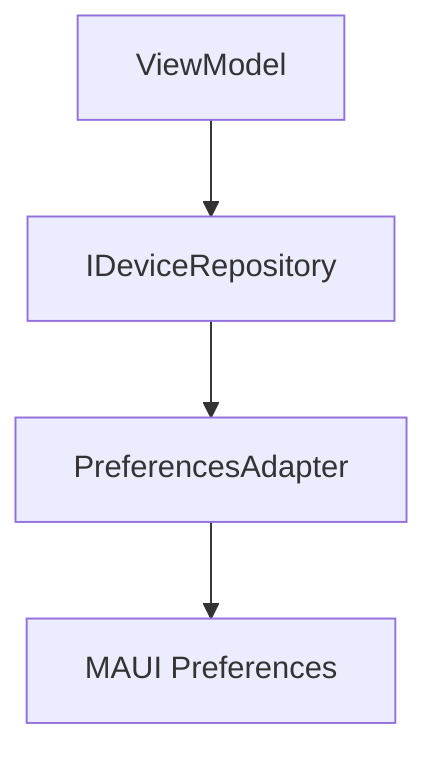
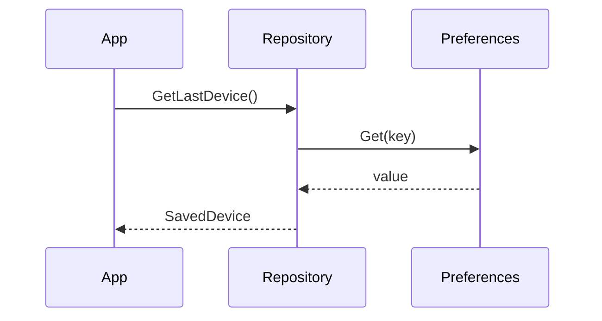
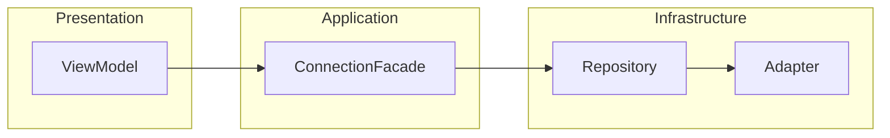

## Steps

### 1. Choose Diagram Type

Select the appropriate Mermaid diagram type:

| Diagram Type      | Use Case                                              |
| ----------------- | ----------------------------------------------------- |
| `flowchart`       | Architecture, data flow, component relationships      |
| `sequenceDiagram` | API calls, message passing, time-ordered interactions |
| `classDiagram`    | Object relationships, inheritance, interfaces         |
| `stateDiagram`    | State machines, workflow states                       |
| `erDiagram`       | Database schemas, entity relationships                |

### 2. Architecture/Flow Diagram



### 3. Sequence Diagram



### 4. Component Diagram



## Why Mermaid?

- Renders properly in GitHub, VS Code, and most markdown viewers
- Maintainable and editable (text-based)
- Consistent styling across specs
- Supports flowcharts, sequence diagrams, class diagrams, and more

## Never Use ASCII Art

```
BAD - Do not use:
+------------------+     +------------------+
|   ViewModel      | --> |   Repository     |
+------------------+     +------------------+
```

ASCII box art (`+-+`, `|`, `+--+`) does not render well and is harder to maintain. Always use Mermaid instead.
