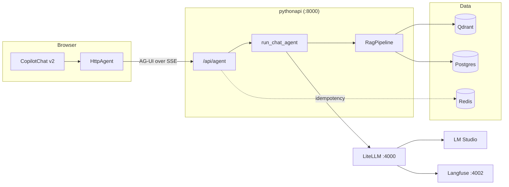

# CLAUDE.md — copilot_agent_network

Nx monorepo. A Next.js chat front end talks to a Python FastAPI agent service
over the AG-UI protocol. The service runs a RAG pipeline over Qdrant and
Postgres, and routes every model call through LiteLLM.

---

## Critical Rules (Always Active)

1. **ASK BEFORE CHANGES** — Never make code changes without user confirmation
2. **CHECK CONTEXT FIRST** — Run `board` and `search` before any spec work
3. **USE LEANSPEC TOOLING** — Never create spec files manually
4. **ALWAYS SAVE TO SPEC** — Persist progress after every completed phase/slice via LeanSpec tooling
5. **ALWAYS EVAL FOR SKILLS** — Before every task, check whether a skill below applies and read it if so. Do NOT read skills by default, but do NOT skip this evaluation.
6. **ALWAYS ASK BEFORE SEARCHING** — Before endlessly searching ask where files and features are located if a grounded starting point is not provided.
7. **PLAIN ENGLISH OUTPUT** — Write all output (chat, comments, commits, PRs, specs, UI text) per ASD-STE100: short sentences, active voice, one idea per sentence, no jargon. See `asd-ste100` skill.
8. **SQLALCHEMY ONLY** — All Postgres access uses SQLAlchemy 2.0 async. Never write raw SQL.

---

## Skills

| Skill                | Path                                         | When to apply                                     |
| -------------------- | -------------------------------------------- | ------------------------------------------------- |
| `leanspec`           | `.claude/skills/leanspec/SKILL.md`           | Creating/updating specs, using LeanSpec MCP tools |
| `leanspec-sdd`       | `.claude/skills/leanspec-sdd/SKILL.md`       | Spec-driven development workflow                  |
| `diagrams`           | `.claude/skills/diagrams/SKILL.md`           | Any diagram, flowchart, or architecture doc       |
| `naming-conventions` | `.claude/skills/naming-conventions/SKILL.md` | Writing or reviewing any identifier names         |
| `gof-patterns`       | `.claude/skills/gof-patterns/SKILL.md`       | Designing classes or choosing structural patterns |
| `asd-ste100`         | `.claude/skills/asd-ste100/SKILL.md`         | Chat, comments, commits, PRs, specs, UI text      |

## Agents

| Agent           | Path                              | When to apply                                           |
| --------------- | --------------------------------- | ------------------------------------------------------- |
| `code-reviewer` | `.claude/agents/code-reviewer.md` | Non-trivial diffs — naming, patterns, async correctness |
| `spec-writer`   | `.claude/agents/spec-writer.md`   | Full LeanSpec spec creation or major spec restructuring |

---

## Quick Reference

| Rule               | Summary                                                         |
| ------------------ | --------------------------------------------------------------- |
| PYTHON = PEP 8     | `snake_case` functions and variables, `PascalCase` classes      |
| TYPESCRIPT = CAMEL | `camelCase` variables, `PascalCase` components and types        |
| NO ABBREVIATIONS   | `cancellation_token` not `ct`, `configuration` not `cfg`        |
| NO MAGIC STRINGS   | Config → `Settings` in `config.py`, UI text → module constants  |
| ENUMS NOT STRINGS  | `Literal` types or `enum.Enum`, never bare string comparison    |
| PATTERN NAMES      | `QdrantEmbeddingIndex` not `VectorService`                      |
| MERMAID ONLY       | No ASCII box art for diagrams                                   |
| ASYNC ALL THE WAY  | No blocking calls in an `async def`. No sync driver in a route. |
| SQLALCHEMY ONLY    | No raw SQL strings anywhere                                     |
| PLAIN ENGLISH      | ASD-STE100: short sentences, active voice                       |

---

## Architecture

The browser talks to FastAPI directly. There is no CopilotKit runtime and no
Next.js proxy route in between.



**Key contracts:**

- `apps/pythonapi/pythonapi/routes/agent.py` is the only contract between the
  two apps. It accepts a `RunAgentInput` and returns AG-UI events over SSE.
- The front end uses `@copilotkit/react-core/v2`. The v1 remote-endpoint
  protocol is not used. The Python `copilotkit` SDK is deliberately absent.
- Every model call goes through LiteLLM at `LLM_BASE_URL`. Never call a model
  provider directly.
- Qdrant holds chunk vectors only. Postgres holds all document, chunk, and
  order metadata.

---

## Tech Stack

| Layer         | Technology                                                       |
| ------------- | ---------------------------------------------------------------- |
| Monorepo      | Nx 23, pnpm 11 (JS/TS), uv (Python), `@nxlv/python` plugin       |
| Front end     | Next.js 16, React 19, CopilotKit v2 (`react-core/v2`), AG-UI     |
| API           | FastAPI, Pydantic Settings, uvicorn                              |
| Agents        | AG-UI protocol, LangChain, LangGraph (planned), BAML             |
| Model gateway | LiteLLM → LM Studio (OpenAI-compatible)                          |
| Vectors       | Qdrant (dense + sparse BM25 via fastembed)                       |
| Relational    | Postgres 16, SQLAlchemy 2.0 async, asyncpg                       |
| Cache         | Redis 7 (idempotency, rate limits)                               |
| Tracing       | Langfuse v2                                                      |
| Documents     | Docling (parsing + hybrid chunking)                              |
| PII           | Presidio analyzer/anonymizer, encrypted vault                    |
| Tests         | pytest + pytest-asyncio (Python), Jest (React), Playwright (e2e) |
| Lint / format | Ruff (Python), ESLint + Prettier (TS)                            |

---

## Codebase Layout

```
apps/
├── agentic-executor/            # Next.js 16 front end (port 4001)
│   ├── specs/                   # Jest component tests
│   └── src/app/
│       ├── layout.tsx           # Wraps the tree in CopilotProvider
│       ├── page.tsx
│       └── features/            # Domain UI, grouped by feature
│           └── chat/            # copilot_provider.tsx, chat_window.tsx
├── agentic-executor-e2e/        # Playwright end-to-end tests
└── pythonapi/                   # FastAPI service (port 8000)
    ├── baml_src/                # BAML source: clients, generators, rag
    ├── tests/                   # pytest suite
    └── pythonapi/
        ├── main.py              # App assembly only — lifespan, middleware, routers
        ├── config.py            # Settings (pydantic-settings). All env vars land here.
        ├── dependencies.py      # FastAPI DI providers
        ├── baml_client/         # GENERATED — never edit, run `nx baml-generate pythonapi`
        ├── core/                # Business logic, no HTTP and no I/O clients
        │   ├── chat_agent.py    # AG-UI event stream for one agent run
        │   ├── rag_pipeline.py  # Retrieve → rerank → generate
        │   ├── embeddings.py, reranking.py, generation.py
        │   ├── document_parsing.py, pii.py
        ├── infrastructure/      # External client builders — one per system
        │   ├── postgres_client.py, qdrant_client.py
        │   ├── redis_client.py, langfuse_client.py
        ├── repositories/        # Persistence — SQLAlchemy and Qdrant only
        │   ├── postgres.py, qdrant.py, orders.py
        │   ├── pii_vault.py, memory.py, base.py
        ├── models/              # Pydantic schemas + SQLAlchemy ORM (orm.py)
        ├── routes/              # HTTP layer — thin, delegates to core/
        │   ├── agent.py         # AG-UI SSE endpoint
        │   ├── documents.py, search.py, orders.py
        │   ├── health.py, openai_proxy.py
        ├── middleware/          # idempotency.py
        └── workers/             # embedding_worker.py — background embed pool
```

> `baml_client/` is generated from `baml_src/`. Regenerate it. Never hand-edit it.
> Layer rule: `routes/` → `core/` → `repositories/` → `infrastructure/`.
> Never import in the other direction.

---

## Build & Test

Run from the repo root. Use **PowerShell**.

```powershell
# Full stack in Docker
nx up apps            # build and start every container
nx watch apps         # dev stack with live sync
nx down apps          # stop the stack

# Python API
nx serve pythonapi    # uvicorn on :8000
nx test pythonapi     # pytest with coverage
nx lint pythonapi     # ruff check
nx format pythonapi   # ruff format
nx baml-generate pythonapi

# Front end
nx dev @agentic-executor/agentic-executor
nx test @agentic-executor/agentic-executor
nx e2e agentic-executor-e2e

# Whole workspace
nx run-many -t lint test
nx affected -t lint test
```

**Dependencies:**

```powershell
pnpm add -w <package>                    # JS/TS at the root
nx add pythonapi --name <package>        # Python, updates uv.lock
```

**Ports:** web 4001 · pythonapi 8000 · LiteLLM 4000 · Langfuse 4002 ·
Qdrant 6333 · Redis 6379

---

## Conventions

### Python

- Every I/O path is `async`. Repositories, routes, and clients all use
  `async def`.
- Build external clients once in `lifespan()` and store them on `app.state`.
  Never build a client per request.
- Optional integrations degrade, they do not crash. Redis, Langfuse, and
  Postgres may all be unset. Qdrant always works through embedded `:memory:`.
- Settings are `UPPER_SNAKE_CASE` fields on the `Settings` class. Read them
  from `settings`, never from `os.environ`.
- Ruff enforces line length 88 and import order. Run `nx format pythonapi`
  before you commit.

### TypeScript / React

- Server Components by default. Add `"use client"` only when the component
  needs state, effects, or browser APIs.
- File names are `snake_case.tsx`. Exported component names are `PascalCase`.
  Example: `chat_window.tsx` exports `ChatWindow`.
- Group by feature under `src/app/features/<feature>/`.
- Build the `HttpAgent` at module scope, not inside a render.

### Comments

Write a comment only when the reason is not obvious from the code. Explain
**why**, never **what**. The existing comments in `main.py` and `config.py`
are the model to follow.

---

# context-mode — MANDATORY routing rules

You have context-mode MCP tools available. These rules are NOT optional.

## BLOCKED

- `curl` / `wget` in Bash → use `ctx_fetch_and_index` or `ctx_execute(javascript, fetch(...))`
- Inline HTTP in Bash → use `ctx_execute`
- `WebFetch` → use `ctx_fetch_and_index` then `ctx_search`

## REDIRECTED

- **Bash with >20 lines output** → `ctx_batch_execute` or `ctx_execute(shell, ...)`
- **Read for analysis** → `ctx_execute_file`; Read is only for files you will Edit
- **Grep with large results** → `ctx_execute(shell, grep ...)`

## Tool hierarchy

1. `ctx_batch_execute(commands, queries)` — primary; runs + indexes + searches in one call
2. `ctx_search(queries: [...])` — follow-up; batch all questions in one array
3. `ctx_execute` / `ctx_execute_file` — sandbox processing; only stdout enters context
4. `ctx_fetch_and_index` → `ctx_search` — web content; raw HTML never enters context
5. `ctx_index` — store arbitrary content for later search

## Output constraints

- Responses under 500 words
- Artifacts go to FILES — return only path + 1-line description

| Command       | Action                                                         |
| ------------- | -------------------------------------------------------------- |
| `ctx stats`   | Call `ctx_stats`, display verbatim                             |
| `ctx doctor`  | Call `ctx_doctor`, run returned command, display as checklist  |
| `ctx upgrade` | Call `ctx_upgrade`, run returned command, display as checklist |
