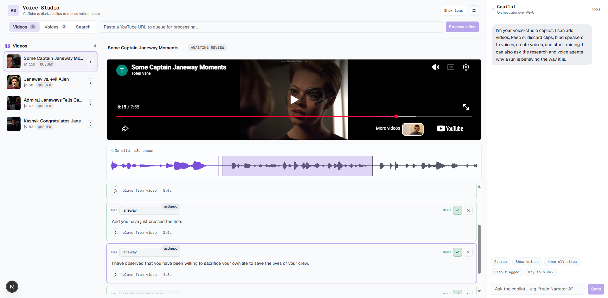
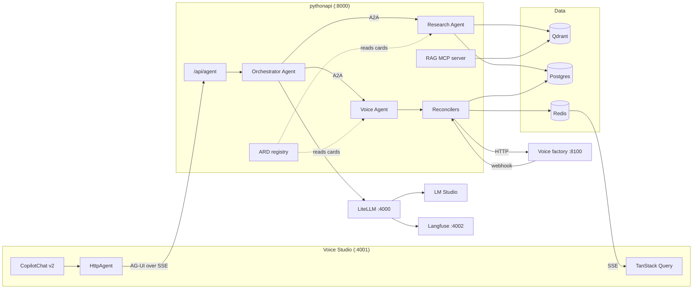
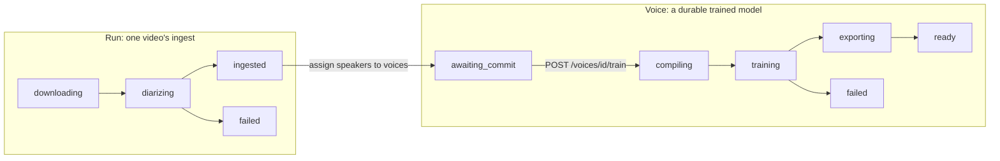

# copilot_agent_network

An Nx monorepo that runs a small network of cooperating agents. A Next.js
studio talks to a Python FastAPI service over the AG-UI protocol. Inside that
service, an Orchestrator delegates to two specialist agents over A2A. One
specialist answers from a RAG corpus in Qdrant and Postgres. The other drives a
GPU voice-training pipeline that turns YouTube audio into a trained Piper voice
model, with a human in the loop on every clip.

Every model call goes through one LiteLLM gateway. Every agent publishes a
machine-readable card. The whole network boots with no environment file at all.


[](assets/audio-filter-example.mp4)
---

## What is interesting here

**Three protocols, each doing the one job it is for.** AG-UI carries a chat run
from the browser to the Orchestrator. A2A carries a delegated task from the
Orchestrator to a specialist. MCP exposes the RAG corpus to any external client.
None of the three wraps another, and no code path hand-rolls a protocol the SDK
already speaks.

**Agents are discovered, not hard-coded.** Each specialist serves an Agent Card
at `<mount>/.well-known/agent-card.json`. The Orchestrator reads capabilities
from that card at delegation time. Add a skill to a specialist and the router
needs no edit.

**One deployment, or many, from the same code.** A specialist mounts inside the
API process by default and is reached over an in-process ASGI transport. Set its
A2A URL and the same app moves to its own port, reached over the network. Both
paths use the SDK's real JSON-RPC client, so delegation code cannot tell which
is which.

**The catalog cannot drift.** The ARD registry at `/api/ard` is derived from the
Agent Card objects themselves, and from the MCP tool roster enum. There is no
second hand-written list of what this deployment publishes.

**Durable state without a checkpointer.** Voice training runs for days, and a
human review can sit longer. So the LangGraph pipelines hold no in-memory
checkpoint. A Postgres phase column is the state machine, and it survives a
restart.

**Lease-based concurrency.** Several API instances can run at once. One atomic
UPDATE claims a run through `leased_until` and `lease_owner`. The lease expires
on its own, so a dead instance never strands work.

**Nothing polls.** The GPU host pushes job changes over a webhook. The webhook
only wakes a reconciler. It never decides state. A lost webhook therefore costs
latency, because the reconcile timer is the backstop.

**Idempotent replay.** Every server-sent event carries the complete object,
never a patch. Applying one twice lands on the same result, which is what makes
reconnect-and-replay cheap.

**Config that cannot drift.** Every setting has a real default in one Pydantic
`Settings` class. The service boots with zero environment files, on offline mock
providers and an in-process Qdrant. A test enforces that no field is silently
`None`.

---

## Architecture

The browser calls FastAPI directly. There is no CopilotKit runtime and no
Next.js proxy route between them.



### Key contracts

- `routes/agent.py` is the only contract between the two apps. It accepts a
  `RunAgentInput` and returns AG-UI events over SSE.
- The front end uses `@copilotkit/react-core/v2` with an AG-UI `HttpAgent`. The
  v1 remote-endpoint protocol is not used, and the Python `copilotkit` SDK is
  deliberately absent.
- Specialists mount outside `/api`. They are not this service's REST surface.
  They are separate agents that happen to share a process.
- The ARD manifest sits at the origin root, because RFC 8615 defines a
  well-known URI that way. It cannot move under `/api`.
- Every model call goes through LiteLLM at `LLM_BASE_URL`. No code calls a
  model provider directly.
- Qdrant holds chunk vectors only. Postgres holds all document, chunk, order,
  run, and voice metadata.
- The browser never calls the voice factory. One forwarder at
  `/api/voice-factory` carries every factory-owned call, so there is one origin
  and one CORS entry.

---

## The agent network

Three agents. One faces the user. Two are specialists that answer over A2A.

| Agent        | Skills                                      | Answers from                     |
| ------------ | ------------------------------------------- | -------------------------------- |
| Orchestrator | `assist`                                    | Delegation, or a direct answer   |
| Research     | `research`                                  | Qdrant and Postgres, through RAG |
| Voice        | `voice_search`, `voice_run`, `voice_status` | Run state and the voice factory  |

Routing is deterministic rules first. An LLM router is the fallback for what the
rules cannot classify safely, not the default, because routing must be
predictable and cheap. The rules match intent words. They never read a
specialist's skill list, because skills come from the cards at delegation time.

The test of value is the diagnosis question. Ask why a training run is slow, and
the Orchestrator must combine the Voice Agent's run data with the Research
Agent's troubleshooting content into one answer. If A2A did not earn that, it
would be decoration. An agent is used where a component has an independent
capability and a useful boundary. A plain function is used everywhere else.

A specialist failure is contained. One agent that cannot be reached does not
touch the other.

See [docs/architecture/agent-network.md](docs/architecture/agent-network.md).

### Discovery

| Surface           | Path                                                     |
| ----------------- | -------------------------------------------------------- |
| Orchestrator card | `/agents/orchestrator/.well-known/agent-card.json`       |
| Research card     | `/agents/research/.well-known/agent-card.json`           |
| Voice card        | `/agents/voice/.well-known/agent-card.json`              |
| ARD manifest      | `/.well-known/ai-catalog.json`                           |
| ARD registry      | `/api/ard/agents`, `/api/ard/search`, `/api/ard/explore` |
| RAG MCP server    | `/mcp/rag`                                               |

The MCP server exposes four read-only tools: `search_documents`,
`answer_question`, `list_documents`, and `get_document`. Each wraps a code path
that already exists and is already tested. `answer_question` runs the same
`RagResearchAgent` the Research Agent runs over A2A, so an MCP client and an A2A
caller get the same answer from one implementation. Write and delete are left
out on purpose: they are corpus mutations that need a permission model an
unauthenticated tool call does not have.

---

## The voice pipeline

`/api/voice` turns a YouTube video into clips. `/api/voices` turns clips into a
trained Piper model. The pipeline itself lives in a separate repository,
`star-trek-voyicer`, because training needs an NVIDIA GPU and Docker, and the
API container pins CPU-only torch.

The split between the two entities is the important part:

- A **run** is one video's ingest. It downloads, diarizes, and rests.
- A **voice** is a durable trained identity. It is built from clips taken from
  many videos, and a video gives clips to many voices.

So there is no "commit a run" step and no run-level training. The unit of work
is a clip decision. The unit of training is a voice. Review is not a phase that
waits for a button, because nobody presses one. Reviewers decide clips, and a
voice compiles whatever the decisions say when it next trains. Review status is
derived from clip state and never stored.



`ingested` is a terminal resting phase, not a review gate. It exists because
`voice_runs.phase` **is** the state machine: the reconciler ticks any run whose
phase it owns, so a run with no resting phase would be re-ticked forever.

Retrain is always available. `POST /api/voices/{id}/train` restarts from
`compiling`, which rebuilds the dataset from every kept clip currently assigned
to that voice, across every video. A retrain therefore always trains on the
reviewer's live decisions, never on what an earlier run left on disk.

### Operating rules

- `VOICE_FACTORY_URL` points at the control API. Unset, every `/api/voice` route
  answers 503 and the reconcilers never start. Nothing else is affected.
- A reconciler is the only writer of phase state. The webhook reports a change
  and calls `wake(id)`. It never decides what the phase becomes.
- Redis carries events, never state. Losing Redis loses live updates and nothing
  else, so a publish failure is logged and swallowed. The Redis Stream ID is
  both the event ID and the SSE `id:`, which is why there is no sequence column.
- A transient factory error holds the phase and increments `error_count`. Only
  `VOICE_MAX_CONSECUTIVE_ERRORS` in a row fail a run, and the retry route puts
  it back in `failed_from_phase`.
- `review.csv` on the factory host stays the one source of truth for clip
  decisions. This service stores state and nothing on disk.
- Training logs stay off the event stream. `GET /runs/{id}/logs` serves them, so
  every browser does not pay for output one screen reads.

To run the control API, in the `star-trek-voyicer` repo:

```powershell
just serve-jeanlucrecord    # http://127.0.0.1:8100
```

Set `VOICE_ORCHESTRATOR_WEBHOOK_URL` and `VOICE_WEBHOOK_TOKEN` there to turn
webhooks on. The token must match `VOICE_WEBHOOK_TOKEN` here. Leave the URL
unset and the factory behaves exactly as before.

---

## Tech stack

| Layer         | Technology                                                       |
| ------------- | ---------------------------------------------------------------- |
| Monorepo      | Nx 23, pnpm 11 (JS/TS), uv (Python), `@nxlv/python` plugin       |
| Front end     | Next.js 16, React 19, CopilotKit v2 (`react-core/v2`), AG-UI     |
| Web state     | TanStack Query, RxJS over one SSE connection, Zustand            |
| API           | FastAPI, Pydantic Settings, uvicorn                              |
| Agent runtime | AG-UI, A2A SDK, MCP, LangChain, LangGraph, BAML                  |
| Discovery     | A2A Agent Cards, ARD catalog and registry                        |
| Model gateway | LiteLLM to LM Studio (OpenAI-compatible)                         |
| Vectors       | Qdrant (dense + sparse BM25 through fastembed), RRF fusion       |
| Relational    | Postgres 16, SQLAlchemy 2.0 async, asyncpg                       |
| Cache         | Redis 7 (idempotency, rate limits, event stream)                 |
| Tracing       | Langfuse v2                                                      |
| Documents     | Docling (parsing and hybrid chunking)                            |
| Reranking     | sentence-transformers cross-encoder                              |
| PII           | Presidio analyzer and anonymizer, encrypted vault                |
| Tests         | pytest + pytest-asyncio (Python), Jest (React), Playwright (e2e) |
| Lint / format | Ruff (Python), ESLint + Prettier (TypeScript)                    |

---

## Get started

You need Docker, Node with pnpm 11, and uv. LM Studio is optional. It serves the
models that LiteLLM points to.

```powershell
# 1. Install JavaScript dependencies
pnpm install

# 2. Create your environment files
Copy-Item .env.example .env.local
Copy-Item apps/pythonapi/.env.example apps/pythonapi/.env.local
Copy-Item apps/agentic-executor/.env.example apps/agentic-executor/.env.local

# 3. Replace every `replace-me` in .env.local with a real secret

# 4. Build and start the whole stack
nx up apps
```

The studio is at `http://localhost:4001`. It is one screen with three tabs:
**Videos** for ingest and clip review, **Voices** for training, and **Search**
for the RAG corpus. A copilot panel sits beside them and can drive the same
workflow from natural language.

---

## Commands

Run every command from the repo root. Use PowerShell.

### Docker stack

```powershell
nx up apps       # build and start every container
nx watch apps    # dev stack with live sync
nx down apps     # stop the compose stack
nx build apps    # build the Docker images only
nx config apps   # print the resolved compose config
```

Every target reads `.env.local` by default. Add `:production` to read `.env`
instead, for example `nx up apps:production`.

### Python API

```powershell
nx serve pythonapi           # uvicorn on :8000
nx test pythonapi            # pytest with coverage
nx lint pythonapi            # ruff check
nx run pythonapi:format      # ruff format
nx baml-generate pythonapi   # regenerate baml_client from baml_src
nx sync pythonapi            # sync the uv environment
nx lock pythonapi            # refresh uv.lock
```

> **`format` is an Nx built-in, so a project name does not scope it.**
> `nx format pythonapi` runs Prettier over the whole workspace and ignores the
> word `pythonapi`. The project's own Ruff target is shadowed by the built-in
> and is only reachable as `nx run pythonapi:format`. The same trap applies to
> `format:check`, `repair`, `migrate`, and `reset`.

### Front end

```powershell
nx dev @agentic-executor/agentic-executor
nx build @agentic-executor/agentic-executor
nx test @agentic-executor/agentic-executor
nx lint @agentic-executor/agentic-executor
nx typecheck @agentic-executor/agentic-executor
nx e2e agentic-executor-e2e
```

### Whole workspace

```powershell
nx run-many -t lint test typecheck
nx affected -t lint test typecheck
```

A project that has no such target is skipped, not failed. `pythonapi` has no
`typecheck`.

### Dependencies

```powershell
pnpm add -w <package>              # JavaScript or TypeScript, at the root
nx add pythonapi --name <package>  # Python, updates uv.lock
```

---

## Ports and endpoints

| Service       | URL                     |
| ------------- | ----------------------- |
| Voice Studio  | `http://localhost:4001` |
| Python API    | `http://localhost:8000` |
| LiteLLM       | `http://localhost:4000` |
| Langfuse      | `http://localhost:4002` |
| Qdrant        | `http://localhost:6333` |
| Redis         | `localhost:6379`        |
| Voice factory | `http://localhost:8100` |

The API mounts every REST router under `/api`. OpenAPI docs are at
`http://localhost:8000/docs`.

### Core

| Method | Path                       | Purpose                       |
| ------ | -------------------------- | ----------------------------- |
| GET    | `/api/health`              | Health and integration status |
| POST   | `/api/agent`               | AG-UI event stream over SSE   |
| POST   | `/api/documents`           | Upload and parse a document   |
| GET    | `/api/documents`           | List documents                |
| GET    | `/api/documents/{id}`      | Get one document              |
| DELETE | `/api/documents/{id}`      | Delete a document             |
| POST   | `/api/search`              | Hybrid search over chunks     |
| POST   | `/api/orders`              | Create an order               |
| GET    | `/api/v1/models`           | OpenAI-compatible model list  |
| POST   | `/api/v1/chat/completions` | OpenAI-compatible chat        |
| POST   | `/api/v1/responses`        | OpenAI-compatible responses   |
| POST   | `/api/v1/embeddings`       | OpenAI-compatible embeddings  |

### Discovery

| Method | Path                           | Purpose                          |
| ------ | ------------------------------ | -------------------------------- |
| GET    | `/.well-known/ai-catalog.json` | ARD publisher manifest           |
| GET    | `/api/ard/agents`              | Browse the catalog, no ranking   |
| POST   | `/api/ard/search`              | Rank the catalog against a query |
| POST   | `/api/ard/explore`             | Facet counts over the catalog    |

### Voice runs and voices

| Method | Path                            | Purpose                           |
| ------ | ------------------------------- | --------------------------------- |
| POST   | `/api/voice/runs`               | Start an ingest run               |
| GET    | `/api/voice/runs`               | List runs                         |
| GET    | `/api/voice/runs/{id}`          | Get one run                       |
| DELETE | `/api/voice/runs/{id}`          | Cancel the job and delete the run |
| POST   | `/api/voice/runs/{id}/assign`   | Map speaker labels to voices      |
| POST   | `/api/voice/runs/{id}/retry`    | Resume from `failed_from_phase`   |
| GET    | `/api/voice/runs/{id}/logs`     | Tail the running job              |
| GET    | `/api/voice/runs/{id}/training` | Epoch, loss, and checkpoints      |
| GET    | `/api/voice/videos/{id}/clips`  | Clips grouped by speaker          |
| DELETE | `/api/voice/videos/{id}`        | Delete a video and its clips      |
| GET    | `/api/voice/events`             | One SSE stream for the dashboard  |
| POST   | `/api/voice/jobs/{id}/events`   | Factory webhook                   |
| POST   | `/api/voices`                   | Create a voice                    |
| GET    | `/api/voices`                   | List or search voices             |
| GET    | `/api/voices/{id}`              | Get one voice                     |
| POST   | `/api/voices/{id}/train`        | Compile the dataset and train     |
| ANY    | `/api/voice-factory/*`          | Forwarder for factory-owned data  |

The forwarder is deliberate. The factory owns videos, clips, review decisions,
characters, and clip audio. A typed route here would be a second definition of
data this service never reads, so there is none. Typed gateway calls still exist
where Python genuinely reads the fields.

---

## Watch behavior

`nx watch apps` does the following:

- Changes under `apps/agentic-executor/src` and `public` sync into the
  container. Next dev reloads automatically.
- Changes under `apps/pythonapi/pythonapi` sync into the container.
  `uvicorn --reload` restarts automatically.
- Dependency or config changes rebuild the affected image. Edit `package.json`,
  `pnpm-lock.yaml`, or `apps/pythonapi/uv.lock` to trigger one.

---

## Configuration

Defaults live in `Settings` (`apps/pythonapi/pythonapi/config.py`). The service
boots with no environment file at all, on offline mock providers and an
in-process Qdrant. That is what `pytest` and `nx serve pythonapi` run on. An
environment variable is an override, never a requirement.

Three locations, one name. Copy each `.env.example` to `.env.local` beside it.

| Location                 | Holds                          |
| ------------------------ | ------------------------------ |
| repo root                | Shared values and every secret |
| `apps/pythonapi/`        | Compose overrides only         |
| `apps/agentic-executor/` | Web runtime settings           |

Each location takes two files. `.env` is for the production pipeline.
`.env.local` is for development and for `nx watch apps`. Compose reads both and
marks each optional, and a later file wins, so `.env.local` overrides `.env`.
A production deployment can therefore ship no file at all and inject variables
through its orchestrator instead.

**To add a setting: add the field to `Settings` with a real default. Stop
there.** Add a key to an env file only when Docker needs a different value. A
key that repeats a default creates the second copy this layout removes.

`tests/test_config.py` enforces that. It builds `Settings` with every variable
stripped and fails if any field is `None` outside a documented allow-list. A
bare `= None` default would otherwise reach its consumer as `None` and fail far
from the cause. `None` is correct only for secrets, and for integrations where
it means "feature off".

The root `.env.local` sets `NX_LOAD_DOT_ENV_FILES=false`. Nx loads `.env.local`
and `.env` from the workspace root, so the rename alone hides nothing. Without
the flag, `nx test pythonapi` inherits the compose host names and hangs trying
to reach `redis` and `pythonapi-db`.

`config.py` sets no Pydantic `env_file` on purpose. A dotenv path would resolve
against the process working directory, not the package, and could silently pick
up an unrelated `.env`. Compose does the injecting.

Leave an optional key commented out to keep it unset. An empty value is not the
same: `Settings` reads `EMBEDDING_DIM=` as `""` and fails to parse it.

Only LiteLLM and Langfuse keep an `environment:` block in `docker-compose.yml`.
They need renamed keys, and `env_file:` passes names verbatim. The vendor fixes
those names, so that list does not drift as this codebase changes.

### Keys worth knowing

| Key                               | Location                 | Purpose                            |
| --------------------------------- | ------------------------ | ---------------------------------- |
| `LITELLM_UPSTREAM_API_BASE`       | repo root                | Primary backend, LM Studio on 1234 |
| `LITELLM_CHAT_BACKEND_MODEL`      | repo root                | Chat model behind `chat-default`   |
| `LITELLM_EMBEDDING_BACKEND_MODEL` | repo root                | Model behind `embedding-default`   |
| `LITELLM_UPSTREAM2_API_BASE`      | repo root                | Fallback backend                   |
| `LITELLM_CHAT2_BACKEND_MODEL`     | repo root                | Chat model behind `chat-backup`    |
| `LLM_API_KEY`                     | repo root                | Gateway master key, optional       |
| `PII_VAULT_ENCRYPTION_KEY`        | repo root                | Key for the encrypted PII vault    |
| `HF_TOKEN`                        | repo root                | Hugging Face model downloads       |
| `LLM_BASE_URL`                    | `apps/pythonapi/`        | Gateway URL the service calls      |
| `EMBEDDING_DIM`                   | `apps/pythonapi/`        | Vector size, must match provider   |
| `CORS_ALLOW_ORIGINS`              | `apps/pythonapi/`        | Comma-separated allowed origins    |
| `VOICE_FACTORY_URL`               | `apps/pythonapi/`        | Voice factory control API          |
| `PUBLIC_BASE_URL`                 | `apps/pythonapi/`        | Base URL the agent cards advertise |
| `NEXT_PUBLIC_PYTHON_API_URL`      | `apps/agentic-executor/` | API base URL the browser calls     |

Three of these need more than a line:

- **The model alias names are not here.** `chat-default`, `chat-backup`, and
  `embedding-default` are literals in `apps/pythonapi/litellm.config.yaml`,
  because the fallback rule keys on them and an env-driven name would let the
  rule and the alias drift apart. These keys pick which box serves each alias,
  not what it is called.
- **`LLM_API_KEY`** is the LiteLLM master key, and the only LLM credential the
  stack has. Leave it unset for a local gateway, and the service sends no
  `Authorization` header. It is not LM Studio's key. LM Studio is keyless.
- **`EMBEDDING_DIM`** must match the active provider: 64 for the mock, 768 for
  nomic-embed. Qdrant fixes a collection's vector size at creation, so delete
  the collection after you change this.

Optional integrations degrade, they do not crash. Redis, Langfuse, and Postgres
can all stay unset. Qdrant always works through embedded `:memory:`.

The PII vault is the one exception, and it is deliberate. An unset key does not
reduce function. It disables masking entirely, so raw PII would flow through.
The service logs a loud warning on that path, because the stakes are higher than
"no idempotency" or "no tracing".

### Providers

Three providers start in `mock` mode, which is what keeps the test suite fully
offline and deterministic. Change them when you want real models:

- `EMBEDDING_PROVIDER`: `mock` or `openai_compatible`
- `RERANK_PROVIDER`: `mock` or `cross_encoder`
- `GENERATION_PROVIDER`: `mock` or `baml`

### Langfuse

The compose stack runs a self-hosted Langfuse v2 service with its own Postgres.
The Python container uses the internal URL `http://langfuse:3000`. The UI is
exposed at `http://localhost:4002`. The stack creates organization `local-org`,
project `pythonapi`, and API keys that match `LANGFUSE_PUBLIC_KEY` and
`LANGFUSE_SECRET_KEY` on first start. The health route reports Langfuse details
only when the client is configured.

---

## Layout

```text
apps/
├── agentic-executor/            # Next.js 16 studio (port 4001)
├── agentic-executor-e2e/        # Playwright end-to-end tests
└── pythonapi/                   # FastAPI service (port 8000)
docs/
├── architecture/                # agent network, research agent, voice agent
├── operations/                  # training runs, troubleshooting
└── voice-training/              # datasets, diarization, Piper training
```

Each app carries its own README:

- [apps/pythonapi](apps/pythonapi/README.md) — the agent service
- [apps/agentic-executor](apps/agentic-executor/README.md) — the studio
- [apps/agentic-executor-e2e](apps/agentic-executor-e2e/README.md) — end-to-end tests

---

## Conventions

See [CLAUDE.md](CLAUDE.md) for the full rules. The short version:

- Python follows PEP 8. Functions and variables use `snake_case`. Classes use
  `PascalCase`.
- TypeScript files use `snake_case.tsx`. Components and types use `PascalCase`.
  Variables use `camelCase`.
- Every I/O path is `async`. No blocking call sits inside an `async def`.
- All Postgres access uses SQLAlchemy 2.0 async. No raw SQL anywhere.
- No abbreviations. Write `cancellation_token`, not `ct`.
- No magic strings. Config goes in `Settings`. UI text goes in module constants.
- Names say what a thing is. `QdrantEmbeddingIndex`, not `VectorService`.
- Diagrams use Mermaid. No ASCII box art.
- A comment explains **why**, never **what**.
- Ruff enforces line length 88. Run `nx run pythonapi:format` before you commit.
- `.gitattributes` pins the working tree to LF. Without it, Prettier writes LF
  over a CRLF checkout and every file shows as modified with no content change.
