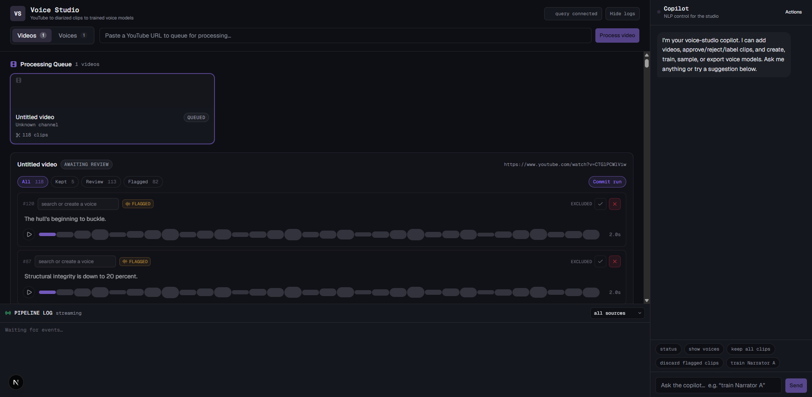
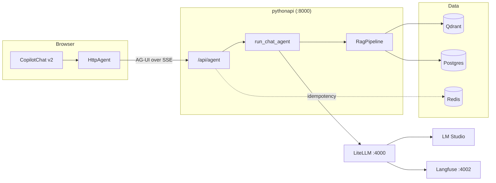
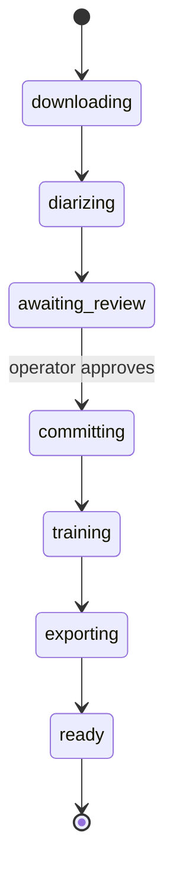

# copilot_agent_network

An Nx monorepo. A Next.js chat front end talks to a Python FastAPI agent
service over the AG-UI protocol. The service runs a RAG pipeline over Qdrant
and Postgres. Every model call goes through LiteLLM. A second pipeline turns
a YouTube video into a fine-tuned voice model, with a human-in-the-loop
review dashboard for the clip data.

> **Status:** actively evolving. The CopilotKit and AG-UI chat surface is
> the largest open item — the front end and the agent endpoint talk to each
> other, but the full streamed chat experience is still being built out.



_The Voice Studio dashboard: a video queues for processing, clips come back
diarized and flagged for review, and an embedded copilot can drive the whole
workflow from natural language._

---

## Highlights

- **Protocol-first agent boundary.** The only contract between the front end
  and the agent service is one FastAPI route
  ([`routes/agent.py`](apps/pythonapi/pythonapi/routes/agent.py)) that speaks
  AG-UI over server-sent events — no bespoke RPC layer, no shared runtime.
- **Webhook-driven pipeline, not polling.** The voice-model pipeline runs on
  a separate GPU host and reports progress over a webhook. A
  [`VoiceRunReconciler`](apps/pythonapi/pythonapi/workers/voice_run_reconciler.py)
  wakes on that signal and is also the single writer of run state, so a lost
  webhook only costs latency — the reconcile timer is the backstop.
- **Durable state without a checkpointer.** Training can run for days and a
  human review can sit longer, so the LangGraph pipeline keeps no in-memory
  checkpoint. The `voice_runs.phase` column in Postgres is the state
  machine, and it survives a restart.
- **Lease-based concurrency.** Multiple API instances can run at once.
  `voice_runs.leased_until` and `lease_owner` provide mutual exclusion
  through one atomic UPDATE, and the lease expires on its own, so a dead
  instance never strands a run.
- **Idempotent event replay.** Every server-sent event carries the full
  run state, never a diff. Applying one twice lands on the same result,
  which is what makes reconnect-and-replay cheap on the dashboard.
- **Config that can't drift.** Every setting has a real default in one
  Pydantic `Settings` class. The service boots with zero environment files —
  that is what the test suite and local dev both run on.

---

## Architecture

The browser calls FastAPI directly. There is no CopilotKit runtime and no
Next.js proxy route between them.



Key contracts:

- `apps/pythonapi/pythonapi/routes/agent.py` is the only contract between the
  two apps. It accepts a `RunAgentInput`. It returns AG-UI events over SSE.
- The front end uses `@copilotkit/react-core/v2`. The v1 remote-endpoint
  protocol is not used. The Python `copilotkit` SDK is deliberately absent.
- Every model call goes through LiteLLM at `LLM_BASE_URL`. Never call a model
  provider directly.
- Qdrant holds chunk vectors only. Postgres holds all document, chunk, and
  order metadata.

---

## Tech stack

| Layer         | Technology                                                       |
| ------------- | ---------------------------------------------------------------- |
| Monorepo      | Nx 23, pnpm 11 (JS/TS), uv (Python), `@nxlv/python` plugin       |
| Front end     | Next.js 16, React 19, CopilotKit v2 (`react-core/v2`), AG-UI     |
| API           | FastAPI, Pydantic Settings, uvicorn, Python 3.10–3.14            |
| Agents        | AG-UI protocol, LangChain, LangGraph, BAML                       |
| Model gateway | LiteLLM → LM Studio (OpenAI-compatible)                          |
| Vectors       | Qdrant (dense + sparse BM25 through fastembed)                   |
| Relational    | Postgres 16, SQLAlchemy 2.0 async, asyncpg                       |
| Cache         | Redis 7 (idempotency, rate limits)                               |
| Tracing       | Langfuse v2                                                      |
| Documents     | Docling (parsing and hybrid chunking)                            |
| Reranking     | sentence-transformers cross-encoder                              |
| PII           | Presidio analyzer and anonymizer, encrypted vault                |
| Tests         | pytest + pytest-asyncio (Python), Jest (React), Playwright (e2e) |
| Lint / format | Ruff (Python), ESLint + Prettier (TypeScript)                    |

---

## Get started

You need Docker, Node with pnpm 11, and uv. LM Studio is optional. It serves
the models that LiteLLM points to.

```powershell
# 1. Install JavaScript dependencies
pnpm install

# 2. Create your environment files
Copy-Item .env.example .env.local
Copy-Item apps/pythonapi/.env.example apps/pythonapi/.env.local
Copy-Item apps/agentic-executor/.env.example apps/agentic-executor/.env.local

# 3. Replace every `replace-me` in .env.local with a real secret

# 4. Build and start the whole stack
nx up apps
```

---

## Commands

Run all commands from the repo root. Use PowerShell.

### Docker stack

```powershell
nx up apps       # build and start every container
nx watch apps    # dev stack with live sync and auto-rebuild
nx down apps     # stop the compose stack
nx build apps    # build the Docker images only
nx config apps   # print the resolved compose config
```

Every target reads `.env.local` by default. Add `:production` to read `.env`
instead, for example `nx up apps:production`.

### Python API

```powershell
nx serve pythonapi          # uvicorn on :8000
nx test pythonapi           # pytest with coverage
nx lint pythonapi           # ruff check
nx format pythonapi         # ruff format
nx baml-generate pythonapi  # regenerate pythonapi/baml_client from baml_src
nx sync pythonapi           # sync the uv environment
nx lock pythonapi           # refresh uv.lock
```

### Front end

```powershell
nx dev @agentic-executor/agentic-executor
nx build @agentic-executor/agentic-executor
nx test @agentic-executor/agentic-executor
nx e2e @agentic-executor/agentic-executor-e2e
```

### Whole workspace

```powershell
nx run-many -t lint test
nx affected -t lint test
```

### Dependencies

```powershell
pnpm add -w <package>              # JavaScript or TypeScript, at the root
nx add pythonapi --name <package>  # Python, updates uv.lock
```

---

## Ports and endpoints

| Service       | URL                     |
| ------------- | ----------------------- |
| Web app       | `http://localhost:4001` |
| Python API    | `http://localhost:8000` |
| LiteLLM       | `http://localhost:4000` |
| Langfuse      | `http://localhost:4002` |
| Qdrant        | `http://localhost:6333` |
| Redis         | `localhost:6379`        |
| Voice factory | `http://localhost:8100` |

The API mounts every router under `/api`. OpenAPI docs are at
`http://localhost:8000/docs`.

| Method | Path                       | Purpose                       |
| ------ | -------------------------- | ----------------------------- |
| GET    | `/api/health`              | Health and integration status |
| POST   | `/api/agent`               | AG-UI event stream over SSE   |
| POST   | `/api/documents`           | Upload and parse a document   |
| GET    | `/api/documents`           | List documents                |
| GET    | `/api/documents/{id}`      | Get one document              |
| DELETE | `/api/documents/{id}`      | Delete a document             |
| POST   | `/api/search`              | Hybrid search over chunks     |
| POST   | `/api/orders`              | Create an order               |
| GET    | `/api/v1/models`           | OpenAI-compatible model list  |
| POST   | `/api/v1/chat/completions` | OpenAI-compatible chat        |
| POST   | `/api/v1/responses`        | OpenAI-compatible responses   |
| POST   | `/api/v1/embeddings`       | OpenAI-compatible embeddings  |

### Voice models

`/api/voice` builds a text-to-speech model from a YouTube video. The pipeline
runs in the separate `star-trek-voyicer` repository, on the host, because
training needs an NVIDIA GPU and Docker. Set `VOICE_FACTORY_URL` to reach it.
Unset, every route below answers 503 and nothing else is affected.

| Method | Path                                      | Purpose                       |
| ------ | ----------------------------------------- | ----------------------------- |
| GET    | `/api/voice/search`                       | Search YouTube for a video    |
| GET    | `/api/voice/characters`                   | Characters with a dataset     |
| POST   | `/api/voice/runs`                         | Start a run                   |
| GET    | `/api/voice/runs`                         | List runs                     |
| GET    | `/api/voice/runs/{id}`                    | Get one run                   |
| DELETE | `/api/voice/runs/{id}`                    | Cancel and delete a run       |
| GET    | `/api/voice/runs/{id}/speakers`           | Clips grouped by speaker      |
| PATCH  | `/api/voice/runs/{id}/clips`              | Keep, reject, or reassign     |
| POST   | `/api/voice/runs/{id}/approve`            | End review and start training |
| GET    | `/api/voice/runs/{id}/clips/{clip}/audio` | Play one clip                 |
| GET    | `/api/voice/runs/{id}/logs`               | Tail the running job          |
| GET    | `/api/voice/runs/{id}/training`           | Epoch, loss, and checkpoints  |

The dashboard is at `http://localhost:4001/voices`. A run walks through these
phases, and stops at `awaiting_review` until a person approves the clips:



---

## Watch behavior

`nx watch apps` does the following:

- Changes under `apps/agentic-executor/src` and `public` sync into the
  container. Next dev reloads automatically.
- Changes under `apps/pythonapi/pythonapi` sync into the container.
  `uvicorn --reload` restarts automatically.
- Dependency or config changes rebuild the affected image.

Examples:

- Edit `apps/agentic-executor/src/...` to update the web app without a full
  image rebuild.
- Edit `apps/pythonapi/pythonapi/...` to restart only the Python API process.
- Edit `package.json`, `pnpm-lock.yaml`, or `apps/pythonapi/uv.lock` to
  trigger a container rebuild.

---

## Configuration

Defaults live in `Settings` (`apps/pythonapi/pythonapi/config.py`). The service
boots with no environment file at all, on offline mock providers and an
in-memory Qdrant — that is what `pytest` and `nx serve pythonapi` use. An
environment variable is an override, never a requirement.

Three locations, one name. Copy each `.env.example` to `.env.local` beside it.

| Location                 | Holds                           |
| ------------------------ | ------------------------------- |
| repo root                | Shared values and every secret  |
| `apps/pythonapi/`        | Compose overrides only, 10 keys |
| `apps/agentic-executor/` | Web runtime settings            |

Each location takes two files. `.env` is for the production pipeline.
`.env.local` is for development and for `nx watch apps`. Compose reads both
and a later file wins, so `.env.local` overrides `.env`.

Both are optional. Compose starts with neither file present, because `Settings`
supplies every default. A production deployment can therefore ship no file at
all and inject variables through its orchestrator instead.

**To add a setting:** add the field to `Settings` with a default. Stop there.
Add a key to an env file only if Docker needs a different value. A key that
repeats a default is the duplication this layout exists to prevent.

`tests/test_config.py` enforces that: it builds `Settings` with every variable
stripped and fails if any field is `None` outside a documented allow-list.

The root `.env.local` sets `NX_LOAD_DOT_ENV_FILES=false`. Nx loads `.env.local`
and `.env` from the workspace root, so the rename alone hides nothing. Without
the flag, `nx test pythonapi` inherits the compose host names and hangs trying
to reach `redis` and `pythonapi-db`.

### Two things that stay explicit

LiteLLM and Langfuse keep `environment:` blocks in `docker-compose.yml`. They
need renamed keys, and `env_file:` passes names verbatim. The vendor fixes those
names, so that list does not drift as this codebase changes.

Leave an optional key commented out to keep it unset. An empty value is not the
same: `Settings` reads `EMBEDDING_DIM=` as `""` and fails to parse it.

### Keys worth knowing

| Key                               | Location                 | Purpose                            |
| --------------------------------- | ------------------------ | ---------------------------------- |
| `LITELLM_UPSTREAM_API_BASE`       | repo root                | Primary backend, LM Studio on 1234 |
| `LITELLM_CHAT_BACKEND_MODEL`      | repo root                | Chat model behind `chat-default`   |
| `LITELLM_EMBEDDING_BACKEND_MODEL` | repo root                | Model behind `embedding-default`   |
| `LITELLM_UPSTREAM2_API_BASE`      | repo root                | Fallback backend, LiteRT on 9379   |
| `LITELLM_CHAT2_BACKEND_MODEL`     | repo root                | Chat model behind `chat-backup`    |
| `LLM_API_KEY`                     | repo root                | Gateway master key, optional       |
| `PII_VAULT_ENCRYPTION_KEY`        | repo root                | Key for the encrypted PII vault    |
| `HF_TOKEN`                        | repo root                | Hugging Face model downloads       |
| `LLM_BASE_URL`                    | `apps/pythonapi/`        | Gateway URL the service calls      |
| `EMBEDDING_DIM`                   | `apps/pythonapi/`        | Vector size, must match provider   |
| `CORS_ALLOW_ORIGINS`              | `apps/pythonapi/`        | Comma-separated allowed origins    |
| `NEXT_PUBLIC_PYTHON_API_URL`      | `apps/agentic-executor/` | API base URL the browser calls     |

Three of these need more than a line:

- **The alias names are not here.** `chat-default`, `chat-backup`, and
  `embedding-default` are literals in `apps/pythonapi/litellm.config.yaml`,
  because the fallback rule keys on them and an env-driven name would let the
  rule and the alias drift apart. These keys pick which box serves each alias,
  not what it is called.
- **`LLM_API_KEY`** is the LiteLLM master key, and the only LLM credential the
  stack has. Leave it unset for a local gateway: the service then sends no
  `Authorization` header. It is not LM Studio's or LiteRT's key. Both are
  keyless, and their placeholder lives in the gateway config.
- **`EMBEDDING_DIM`** must match the active provider: 64 for the mock, 768 for
  nomic-embed. Qdrant fixes a collection's vector size when it creates the
  collection, so delete the collection after you change this.

Optional integrations degrade, they do not crash. Redis, Langfuse, and
Postgres can all stay unset. Qdrant always works through embedded `:memory:`.

### Providers

Three providers start in `mock` mode. Change them when you want real models:

- `EMBEDDING_PROVIDER`: `mock` or `openai_compatible`
- `RERANK_PROVIDER`: `mock` or `cross_encoder`
- `GENERATION_PROVIDER`: `mock` or `baml`

### Langfuse

The compose stack runs a self-hosted Langfuse v2 service with its own
Postgres. The Python container uses the internal URL `http://langfuse:3000`.
The UI is exposed at `http://localhost:4002`.

The stack creates these on first start:

- organization id `local-org`
- project id `pythonapi`
- API keys that match `LANGFUSE_PUBLIC_KEY` and `LANGFUSE_SECRET_KEY`

The health route reports Langfuse details only when the client is configured.

---

## Layout

```text
apps/
├── agentic-executor/            # Next.js 16 front end (port 4001)
│   ├── specs/                   # Jest component tests
│   └── src/app/
│       ├── layout.tsx           # Wraps the tree in CopilotProvider
│       ├── page.tsx
│       └── features/chat/       # copilot_provider.tsx, chat_window.tsx
├── agentic-executor-e2e/        # Playwright end-to-end tests
└── pythonapi/                   # FastAPI service (port 8000)
    ├── baml_src/                # BAML source: clients, generators, rag
    ├── litellm.config.yaml      # LiteLLM model aliases
    ├── tests/                   # pytest suite
    └── pythonapi/
        ├── main.py              # App assembly only
        ├── config.py            # Settings. All env vars land here.
        ├── dependencies.py      # FastAPI DI providers
        ├── baml_client/         # GENERATED — never edit
        ├── core/                # Business logic. No HTTP, no I/O clients.
        ├── infrastructure/      # External client builders
        ├── repositories/        # SQLAlchemy and Qdrant persistence
        ├── models/              # Pydantic schemas and SQLAlchemy ORM
        ├── routes/              # Thin HTTP layer
        ├── middleware/          # idempotency.py
        └── workers/             # embedding_worker.py
```

`baml_client/` is generated from `baml_src/`. Regenerate it with
`nx baml-generate pythonapi`. Never edit it by hand.

Layer rule: `routes/` → `core/` → `repositories/` → `infrastructure/`. Never
import in the other direction.

---

## Conventions

See [CLAUDE.md](CLAUDE.md) for the full rules. The short version:

- Python follows PEP 8. Functions and variables use `snake_case`. Classes use
  `PascalCase`.
- TypeScript files use `snake_case.tsx`. Components and types use
  `PascalCase`. Variables use `camelCase`.
- Every I/O path is `async`. No blocking call sits inside an `async def`.
- All Postgres access uses SQLAlchemy 2.0 async. No raw SQL anywhere.
- No abbreviations. Write `cancellation_token`, not `ct`.
- No magic strings. Config goes in `Settings`. UI text goes in module
  constants.
- Diagrams use Mermaid. No ASCII box art.
- Ruff enforces line length 88. Run `nx format pythonapi` before you commit.
