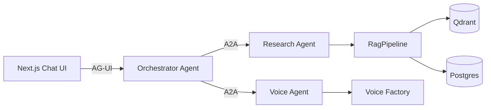
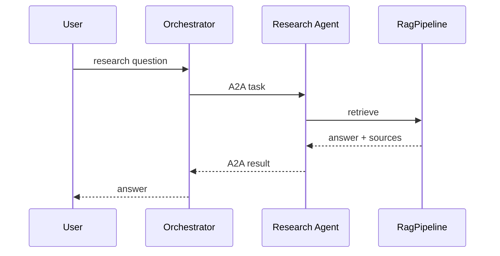
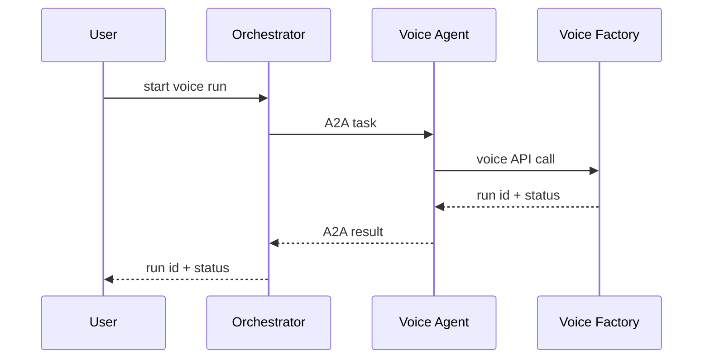
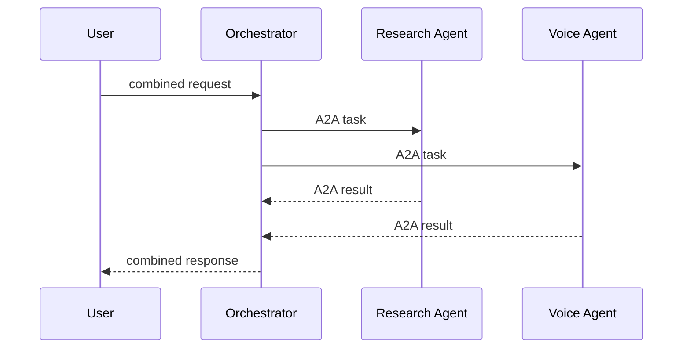
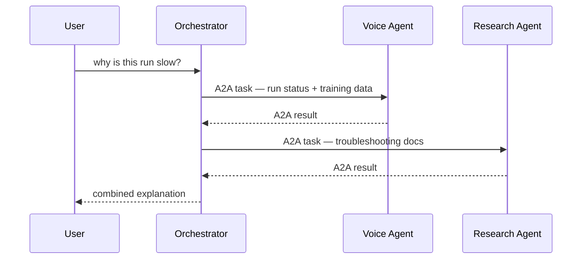

# Architecture Diagrams

Target architecture, protocol responsibilities, and example workflow traces.
Referenced from `SPEC.md` Why and Success signal.

## Target architecture



## Protocol responsibilities

| Boundary | Protocol | Purpose |
|---|---|---|
| Browser to Orchestrator | AG-UI | User interaction and streamed UI events |
| Orchestrator to specialists | A2A | Agent-to-agent task delegation |
| Research Agent to RAG tools | Existing application interfaces | Document retrieval |
| Voice Agent to voice factory | Existing HTTP/webhook design | Voice workflow execution |

## Example workflows

### Research only

> What are the requirements for a voice training dataset?



### Voice only

> Start a voice run for this video.



### Research and voice

> Check the training requirements, then tell me if this run is ready for training.



The two specialists remain independent; the Orchestrator combines results.

### Operational diagnosis — the reference demonstration

> Why is this voice training run taking so long?



This is the primary demonstration of useful multi-agent collaboration and
the basis of `SPEC.md`'s Success signal.

## Trace shape

```text
AG-UI request
  -> Orchestrator
  -> A2A client
  -> Specialist Agent
  -> Specialist tools
  -> A2A response
  -> Orchestrator
```

Recorded per span: `agent.name`, `agent.skill`, `a2a.task_id`,
`a2a.context_id`, `a2a.target`, `a2a.status`. No secrets, no hidden model
reasoning.
