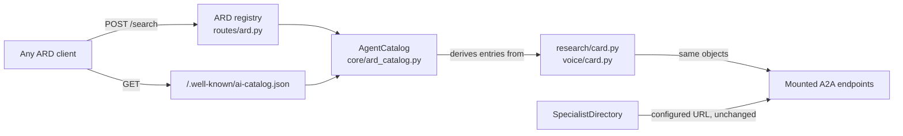

# CAP-8 — ARD publisher and registry

Implementation plan for Agentic Resource Discovery in `pythonapi`.

**Target spec revision:** ARD v0.9 (Proposal), `ards-project/ard-spec@main`,
read 2026-08-23. The spec is a draft. Pin this line and update it when the
implementation moves to a newer revision.

---

## What ARD is, in one paragraph

ARD defines two roles. A **publisher** hosts a static `ai-catalog` JSON
manifest that lists its agentic resources. A **registry** indexes catalogs and
answers `POST /search` and `POST /explore`. An ARD entry does not contain the
agent's capabilities. It carries a `type` and a `url` that point at the real
artifact — for us, `application/a2a-agent-card+json` pointing at an A2A Agent
Card. So ARD sits above the Agent Card. It never replaces it.



## The one rule that keeps this honest

**The catalog is derived from the Agent Cards, never hand-maintained beside
them.** `agents/research/card.py` and `agents/voice/card.py` already build
real `AgentCard` objects. The catalog builder reads those objects. A second
hand-written list of agents would drift from the cards within a week, and
drift is the exact failure ARD exists to prevent.

The field mapping falls out cleanly:

| ARD entry field         | Source on the A2A `AgentCard`                   |
| ----------------------- | ----------------------------------------------- |
| `identifier`            | `urn:air:<publisher>:agent:<card.name>`         |
| `displayName`           | `card.name`                                     |
| `type`                  | `application/a2a-agent-card+json` (constant)    |
| `url`                   | the specialist's public card URL                |
| `description`           | `card.description`                              |
| `capabilities`          | `[skill.id for skill in card.skills]`           |
| `representativeQueries` | flattened `skill.examples` across skills        |
| `version`               | `card.version`                                  |

`AgentSkill.examples` is already part of the A2A card schema and already
carries natural-language examples. ARD's `representativeQueries` wants exactly
that, and says SHOULD contain 2–5. So the two specs line up with no new
hand-written data.

**Verified 2026-08-23.** Both cards populate `examples`. The Research card
carries 2. The Voice card carries 5 across its 4 skills, and the
`voice_status` skill already includes *"Why is my training run slow?"* — the
spec's own success-signal question. So the reference case can be proven
through `/search` ranking, not asserted.

## Ranking

ARD says registries use `representativeQueries` to build semantic embeddings
for search ranking. The repo already has `core/embeddings.py` and Qdrant.

**Do not create a Qdrant collection for two entries.** Embed the queries with
the existing embedding function and score cosine similarity in memory. It is
the same algorithm without the index, and it keeps the registry working when
Qdrant is not configured. Revisit only if the catalog grows past a few dozen
entries. `score` is reported 0–100 per the spec examples.

Fall back to keyword overlap on `capabilities` and `tags` when the embedding
backend is unavailable, so `/search` degrades instead of failing — the same
rule the rest of the service follows for optional integrations.

## Endpoints

| Route                               | Purpose                                     |
| ----------------------------------- | ------------------------------------------- |
| `GET /.well-known/ai-catalog.json`  | Static publisher manifest                   |
| `POST /api/ard/search`              | Ranked results for a natural-language query |
| `POST /api/ard/explore`             | Registry introspection, filters and facets  |

**Verified 2026-08-23 — the registry needs a base path.** `routes/search.py`
already mounts `APIRouter(prefix="/search")` under `APIRouter(prefix="/api")`,
so the existing document search lives at `/api/search`. A bare `/search` at
the app root would not technically collide, but two unrelated search endpoints
one path segment apart is a trap. `/api/ard` keeps the repo's `/api`
convention, and the ARD conformance tool's own README example targets
`https://registry.example.com/api/ard`, so a base path is the expected shape.

The manifest is a well-known URI and must stay at the true root. It cannot sit
under `/api`.

Shared `query` object: `{text, filter}`. `filter` keys are field paths into
the catalog entry. `/search` adds `federation` and pagination; `/explore` adds
`orderBy` and facets. Defaults per spec: `/search` `pageSize` 10 (max 100),
`/explore` `pageSize` 20 (max 100).

`federation` is accepted and `none` is honoured. We publish no referrals and
call no upstream registry — that is a recorded non-goal, not an omission.

## Layering

Follows the existing rule, `routes/` → `core/` → `repositories/`.

- `core/ard_catalog.py` — builds entries from the cards, ranks a query.
  No HTTP.
- `models/ard.py` — Pydantic models for the manifest, entry, and the search
  and explore request/response shapes.
- `routes/ard.py` — the three endpoints. Thin, delegates to core.
- `config.py` — `ARD_PUBLISHER_DOMAIN` (placeholder default),
  `ARD_ENABLED` (default true), `ARD_SEARCH_PAGE_SIZE_DEFAULT`.
  Real defaults, never a bare `None`.

`SpecialistDirectory` is **not** changed by this work. It keeps resolving
specialists from configured URLs. ARD is the outward-facing catalog; the
directory is the inward delegation path. Wiring the directory to consume ARD
would add a second staleness problem on top of the one already open in the
card cache, and buys nothing while the agent set is fixed at two.

## Conformance

The spec ships an official CLI. This is what turns "we implemented ARD" into
a checkable claim:

```bash
./bin/conformance-test manifest <path-to-ai-catalog.json>
./bin/conformance-test registry http://localhost:8000
```

**Open item:** confirm whether `conformance/bin/conformance-test` ships as a
prebuilt binary or needs a toolchain to build. That decides whether it can go
in CI or stays a manual gate. Check before promising CI integration.

## What is deliberately not built

- Federation, referrals, upstream registry calls.
- `trustManifest`, SPIFFE identity, attestations, JWS signing. An unsigned
  entry is honest. A faked one is not.
- Real domain anchoring. The publisher domain is a placeholder and the docs
  must say the trust binding is not real.
- Write APIs. The catalog is derived from code, so there is nothing to POST.

## Risks

1. **v0.9 Proposal.** The schema will change. Everything here is one module
   and one model file, so the blast radius of a spec bump is small by design.
2. ~~`skill.examples` may be empty.~~ Checked. Both cards populate it.
3. ~~`/search` and `/explore` may collide.~~ Checked. Resolved by mounting the
   registry under `/api/ard`.
4. **The conformance tool may not be runnable here.** Its build requirements
   are still unconfirmed. If it needs a toolchain we do not have, CAP-8's
   success criterion loses its objective half and falls back to our own tests.
   Confirm before treating conformance as proven.
