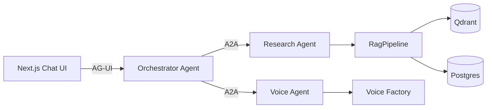

# Multi-Agent A2A Implementation Specification

**Status:** Proposed  
**Scope:** `copilot-agent-network`  
**Primary goal:** Add a small multi-agent architecture that demonstrates real A2A use without adding unnecessary agent layers.

## 1. Objective

Implement three agent roles:

1. **Orchestrator Agent**
2. **Voice Agent**
3. **Research Agent**

The Orchestrator Agent is the entry point for user requests.

The Voice Agent owns voice-model workflows.

The Research Agent owns document research.

The Research Agent uses the existing RAG pipeline.

The Voice Agent does not depend on RAG for normal voice operations.

The Orchestrator Agent can call either specialist through A2A.

The design MUST remain small.

## 2. Current System Context

The repository already has:

- Next.js chat UI.
- FastAPI agent service.
- AG-UI over SSE.
- `run_chat_agent`.
- A RAG pipeline.
- Qdrant.
- Postgres.
- LiteLLM.
- LangGraph.
- A separate voice factory.
- Durable voice run state.
- Human review for voice clips.

The current API has document endpoints and voice endpoints.

The current voice factory runs on a separate GPU host.

Do not merge the RAG pipeline into the voice pipeline.

Do not add RAG calls to voice operations unless a future feature needs research.

## 3. Target Architecture



Protocol responsibilities:

| Boundary | Protocol | Purpose |
|---|---|---|
| Browser to Orchestrator | AG-UI | User interaction and streamed UI events |
| Orchestrator to specialists | A2A | Agent-to-agent task delegation |
| Research Agent to RAG tools | Existing application interfaces | Document retrieval |
| Voice Agent to voice factory | Existing HTTP/webhook design | Voice workflow execution |

MCP is not required for this first implementation.

Do not add MCP only to make the architecture look larger.

## 4. Agent Responsibilities

### 4.1 Orchestrator Agent

The Orchestrator Agent MUST:

- Receive user requests from the existing AG-UI endpoint.
- Classify the request at a high level.
- Decide when to use the Research Agent.
- Decide when to use the Voice Agent.
- Support requests that require both agents.
- Return a final user-facing response.
- Hide specialist implementation details from the user.

The Orchestrator Agent MUST NOT:

- Implement document retrieval.
- Implement voice processing.
- Access Qdrant directly for delegated research.
- Access the voice factory directly for delegated voice work.
- Create an agent for every tool.

Initial routing categories:

```text
research
voice
research_and_voice
general
```

Use deterministic routing where possible.

Use an LLM router only when the request cannot be classified safely with simple rules.

### 4.2 Research Agent

The Research Agent MUST:

- Expose an A2A endpoint.
- Publish an Agent Card.
- Accept research questions.
- Use the existing `RagPipeline`.
- Return an answer with source references when available.
- Return a clear no-results response when the corpus has no relevant content.

The Research Agent MUST NOT:

- Start voice runs.
- Modify voice run state.
- Call the voice factory.
- Become a general-purpose autonomous agent.

Initial skill:

```text
research
```

Example request:

> Research the repository documentation for the requirements for voice training.

Example result:

```json
{
  "answer": "Voice training requires ...",
  "sources": [
    {
      "document_id": "doc-123",
      "title": "piper-training.md"
    }
  ]
}
```

### 4.3 Voice Agent

The Voice Agent MUST:

- Expose an A2A endpoint.
- Publish an Agent Card.
- Accept voice workflow requests.
- Use the existing voice API and voice factory.
- Preserve the existing durable run state model.
- Support human review where the current workflow requires it.
- Return run identifiers and status information.

Initial skills:

```text
voice_search
voice_run
voice_status
voice_review
```

The Voice Agent MUST NOT:

- Own the RAG pipeline.
- Query Qdrant for normal voice operations.
- Duplicate voice run persistence.
- Replace the existing voice reconciler.

## 5. A2A Contract

Use the current released A2A specification supported by the selected SDK.

At implementation time, pin the SDK and protocol version.

Do not create a custom JSON protocol and call it A2A.

Each specialist MUST expose an Agent Card.

Use the standard well-known location:

```text
/.well-known/agent-card.json
```

Each Agent Card MUST declare:

- Agent name.
- Agent description.
- Service URL.
- Protocol version.
- Supported capabilities.
- Supported skills.
- Input modes.
- Output modes.

The A2A specification defines Agent Cards for discovery and tasks for stateful work.

The implementation MUST use standard A2A task operations supported by the selected SDK.

The A2A specification requires core task operations such as message send, task retrieval, and task cancellation.

Use streaming only if it reduces implementation complexity.

Do not implement push notifications in the first version.

## 6. Task Model

A delegated task MUST have:

- A unique task ID.
- A correlation ID or context ID.
- A clear input.
- A clear result.
- A terminal state.

The Orchestrator MUST record:

```text
user request
orchestrator decision
target agent
A2A task ID
task result
final response
```

Do not persist full agent reasoning.

Do not persist hidden chain-of-thought.

## 7. Research Corpus

The RAG pipeline currently has no required business dependency on the voice workflow.

Do not create artificial dependencies.

Add a small documentation corpus for the Research Agent.

The initial corpus SHOULD contain documents about:

```text
docs/
  voice-training/
    dataset-requirements.md
    diarization.md
    piper-training.md
    troubleshooting.md
  architecture/
    agent-network.md
    voice-agent.md
    research-agent.md
  operations/
    training-runs.md
    troubleshooting.md
```

The exact location MAY differ from this list.

The important requirement is that the documents are real project knowledge.

The Research Agent MUST be useful without a voice run being active.

## 8. Example Workflows

### 8.1 Research Only

User:

> What are the requirements for a voice training dataset?

Flow:

```text
User
  -> Orchestrator
  -> A2A Research Agent
  -> RagPipeline
  -> Orchestrator
  -> User
```

### 8.2 Voice Only

User:

> Start a voice run for this video.

Flow:

```text
User
  -> Orchestrator
  -> A2A Voice Agent
  -> Voice API / Voice Factory
  -> Orchestrator
  -> User
```

### 8.3 Research and Voice

User:

> Check the training requirements, then tell me if this run is ready for training.

Flow:

```text
User
  -> Orchestrator
       -> A2A Research Agent
       -> A2A Voice Agent
  -> Orchestrator
  -> User
```

The agents MUST remain independent.

The Orchestrator combines their results.

### 8.4 Operational Diagnosis

User:

> Why is this voice training run taking so long?

Flow:

```text
User
  -> Orchestrator
       -> A2A Voice Agent
          -> run status and training data
       -> A2A Research Agent
          -> relevant troubleshooting documents
  -> Orchestrator
  -> User
```

This is the primary demonstration of useful multi-agent collaboration.

## 9. Repository Structure

Prefer this structure:

```text
apps/
  pythonapi/
    pythonapi/
      agents/
        orchestrator/
        research/
        voice/
      a2a/
        client.py
        models.py
        discovery.py
      ...

  agentic-executor/
    ...

specs/
  multi-agent-a2a.md
```

The exact module names MAY change if they fit the existing architecture better.

Do not create a new application for every agent unless deployment isolation requires it.

For the first implementation, separate agent boundaries logically.

Run them in separate processes only if required to prove remote A2A communication.

## 10. Deployment

Local development SHOULD support:

```text
orchestrator:8000
research-agent:8001
voice-agent:8002
```

The specialist agents SHOULD be independently startable.

The Orchestrator SHOULD discover their Agent Cards from configuration.

Do not hard-code specialist capabilities in the router when Agent Card discovery can provide them.

A configured URL MAY be used for local development.

Example:

```text
RESEARCH_AGENT_A2A_URL=http://research-agent:8001
VOICE_AGENT_A2A_URL=http://voice-agent:8002
```

Do not require service discovery infrastructure.

## 11. Failure Handling

If the Research Agent is unavailable:

- The Orchestrator MUST return a useful error.
- The Voice Agent MUST remain usable.

If the Voice Agent is unavailable:

- The Orchestrator MUST return a useful error.
- Research MUST remain usable.

If both are unavailable:

- The Orchestrator MUST still handle general requests.

A failed A2A task MUST NOT leave the user request in an unknown state.

The Orchestrator MUST include the A2A task ID in logs.

## 12. Observability

Use the existing Langfuse and OpenTelemetry strategy.

Record:

```text
agent.name
agent.skill
a2a.task_id
a2a.context_id
a2a.target
a2a.status
```

Trace the following:

```text
AG-UI request
  -> Orchestrator
  -> A2A client
  -> Specialist Agent
  -> Specialist tools
  -> A2A response
  -> Orchestrator
```

Do not log secrets.

Do not log hidden model reasoning.

## 13. Security

The first local implementation MAY use unauthenticated internal A2A calls.

Production configuration MUST support authenticated A2A calls.

Agent Cards MUST NOT contain secrets.

Network access SHOULD restrict specialist agents to trusted callers.

Validate all A2A inputs before execution.

Do not allow a remote agent to call arbitrary local functions.

## 14. Testing

Add unit tests for:

- Orchestrator routing.
- Research Agent skill handling.
- Voice Agent skill handling.
- Agent Card generation.
- A2A task creation.
- A2A task completion.
- A2A task failure.
- A2A task cancellation.
- Specialist unavailable.
- Research result with no sources.
- Research result with sources.
- Voice run delegation.

Add an integration test that proves:

```text
Orchestrator
  -> A2A
  -> Research Agent
  -> RAG Pipeline
  -> result
```

Add an integration test that proves:

```text
Orchestrator
  -> A2A
  -> Voice Agent
  -> mock Voice Factory
  -> result
```

Add one end-to-end test for the combined diagnostic workflow.

The tests MUST use mocks for external GPU training.

Do not require a real voice model training job in CI.

## 15. Acceptance Criteria

The implementation is complete when all of these are true:

- [ ] The existing AG-UI entry point remains functional.
- [ ] The Orchestrator is the only UI-facing agent.
- [ ] The Research Agent is independently addressable.
- [ ] The Voice Agent is independently addressable.
- [ ] Both specialist agents expose valid Agent Cards.
- [ ] The Orchestrator can discover both specialist agents.
- [ ] The Orchestrator can delegate a research task through A2A.
- [ ] The Orchestrator can delegate a voice task through A2A.
- [ ] The Orchestrator can use both agents for one request.
- [ ] A2A task IDs appear in logs and traces.
- [ ] Research uses the existing RAG pipeline.
- [ ] Voice operations do not require RAG.
- [ ] The existing voice state machine remains the source of truth.
- [ ] The existing voice reconciler remains the source of truth for external run updates.
- [ ] No custom protocol is presented as A2A.
- [ ] No unnecessary agent layer is introduced.
- [ ] CI does not require a GPU.
- [ ] Existing tests continue to pass.
- [ ] New A2A tests pass.
- [ ] The README documents the new architecture.

## 16. Implementation Order

Implement in this order.

### Phase 1: Agent boundaries

- Extract the current chat logic into the Orchestrator Agent.
- Define Research Agent interfaces.
- Define Voice Agent interfaces.
- Keep existing business logic intact.

### Phase 2: Research Agent

- Add the Research Agent.
- Connect it to `RagPipeline`.
- Add the Agent Card.
- Add A2A task handling.
- Add a small project documentation corpus.
- Add tests.

### Phase 3: Voice Agent

- Add the Voice Agent.
- Move voice orchestration behind the agent boundary.
- Preserve the existing voice API and state model.
- Add the Agent Card.
- Add A2A task handling.
- Add tests.

### Phase 4: Orchestrator delegation

- Add Agent Card discovery.
- Add A2A client support.
- Add deterministic routing.
- Add multi-agent workflow handling.
- Add task correlation.
- Add failure handling.

### Phase 5: Demonstration

Implement the diagnostic workflow:

> Why is this voice training run taking so long?

The Orchestrator MUST:

1. Ask the Voice Agent for run information.
2. Ask the Research Agent for relevant troubleshooting information.
3. Combine the results.
4. Return a concise explanation.

### Phase 6: Documentation

Update the README.

Show:

- AG-UI.
- Orchestrator.
- A2A.
- Research Agent.
- Voice Agent.
- RAG.
- Voice Factory.

Document why each protocol exists.

Do not claim that RAG is part of normal voice processing.

## 17. Non-Goals

Do NOT implement:

- A swarm of agents.
- Agent-to-agent free-form conversations.
- An agent for every tool.
- A separate planner agent.
- A separate reviewer agent.
- A separate memory agent.
- MCP solely for demonstration.
- A2A push notifications.
- A2A registry infrastructure.
- Distributed consensus.
- Agent self-replication.
- Automatic agent creation.
- Real GPU training in CI.

## 18. Design Rule

Use an agent when the component has an independent capability and a useful agent boundary.

Use a normal function or service when it does not.

The architecture MUST favor simple boundaries over agent count.

The final system MUST demonstrate that A2A provides value.

The final system MUST NOT use A2A as decoration.

## 19. Reference

A2A defines independent agent communication, Agent Cards, messages, tasks, artifacts, and task lifecycle management.

The current A2A specification is available from the official specification site:

https://a2a-protocol.org/latest/specification/

Use the specification version supported by the selected implementation SDK.
