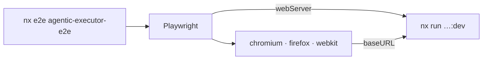

# agentic-executor-e2e

End-to-end tests for the Voice Studio. Playwright drives a real browser against
a real Next.js server.

See the [repo README](../../README.md) for the stack as a whole, and
[agentic-executor](../agentic-executor/README.md) for the app under test.

---

## Status

**The suite is a scaffold, and it is deliberately thin.** The studio's UX is
still moving: tabs, clip review, and the copilot panel are all being reshaped.
A broad end-to-end suite written against a layout that is about to change costs
more to maintain than it catches, so coverage waits until the UX settles.

Correctness is covered in the meantime by the layers that are stable: `pytest`
over every API surface, and Jest over the front end's data layer.

One consequence to know before you run it: the single spec in `src/` asserts an
`h1` of "Voice models", and the studio now renders "Voice Studio". It fails
until it is rewritten with the rest of the suite.

---

## How it runs



Playwright starts the dev server itself through its `webServer` block, and
reuses one that is already running. So a local `nx dev` in another terminal
makes the suite start faster, and nothing breaks if there is none.

The suite runs against three browser projects: Chromium, Firefox, and WebKit.
Mobile and branded-browser projects are present but commented out.

A trace is collected on the first retry of a failing test. Open it with
`npx playwright show-trace <path>`.

---

## Commands

Run from the repo root, in PowerShell.

```powershell
nx e2e agentic-executor-e2e                  # every project
nx e2e agentic-executor-e2e -- --ui          # the Playwright UI runner
nx e2e agentic-executor-e2e -- --project=chromium
nx e2e agentic-executor-e2e -- --headed
```

The `e2e` target is inferred by `@nx/playwright`, so this project carries no
`project.json`. Its `package.json` declares one implicit dependency on the web
app, which is what makes `nx affected` run these tests when the app changes.

Playwright's browsers install separately:

```powershell
npx playwright install
```

---

## Configuration

| Variable   | Default                 | Purpose               |
| ---------- | ----------------------- | --------------------- |
| `BASE_URL` | `http://localhost:3000` | The origin under test |

The default matches `next dev`, which is what the `webServer` block starts.
The **compose** stack publishes the same app on `http://localhost:4001`, so
point `BASE_URL` there to test a running container instead of a dev server.
Set it to the deployed origin in CI.

The config is a `.mts` file on purpose. Node forces ESM for that extension
regardless of the workspace `type`, Playwright routes `.mts` through its ESM
loader rather than the CJS compile path, and Nx's native TypeScript strip loads
it directly. Playwright's config loader discovers it by extension.

---

## Writing a test

```text
apps/agentic-executor-e2e/
├── playwright.config.mts
└── src/
    └── *.spec.ts
```

Anything matching `src/**/*.spec.ts` is collected.

Two things worth holding to when the suite grows:

- **Test the workflow, not the markup.** The valuable paths here cross
  processes: queue a video and watch its phase advance over SSE, assign a
  speaker to a voice, ask the copilot to do the same thing and see the same
  cache update. Those are what a unit test cannot reach.
- **Prefer role and text queries over CSS selectors.** The `h1` assertion that
  now fails is the argument: it broke on a heading rename that changed no
  behaviour at all.
