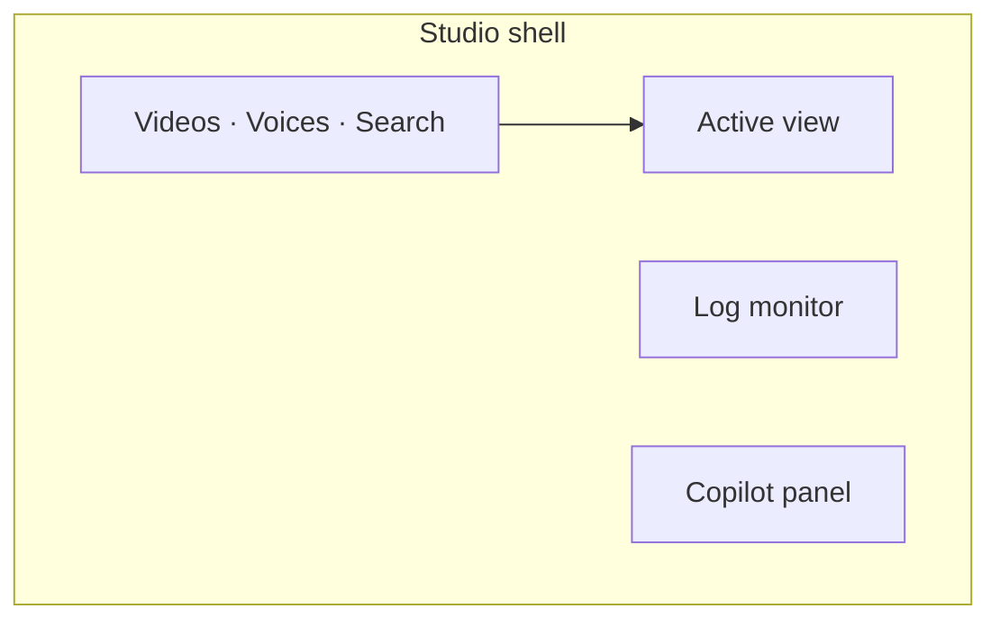
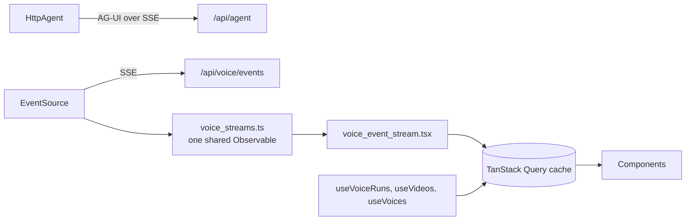

# agentic-executor

The Voice Studio. A Next.js 16 front end that turns YouTube audio into trained
voice models, and lets a copilot drive the same workflow from natural language.

It runs on port 4001. It talks to `pythonapi` on port 8000 and to nothing else.

See the [repo README](../../README.md) for the stack as a whole.

---

## The screen

One screen, three tabs, one live connection.



- **Videos** — queue a video, watch it download and diarize, then review clips
  against the source video and assign each speaker to a voice.
- **Voices** — every durable voice, its training phase, and its contributions.
- **Search** — hybrid search over the RAG corpus.

The log monitor tails the running job along the bottom. The copilot panel sits
on the right and registers tools that read the same studio selection and write
through the same query hooks the components use. Ask it to queue a video, and
the Videos tab updates. There is no second code path.

---

## How it talks to the API

Two channels, and neither one polls.



**Chat** goes through an AG-UI `HttpAgent` straight to `/api/agent`. There is no
CopilotKit runtime and no Next.js proxy route in between. The agent is built
once at module scope, never per render: CopilotKit keys run state off the agent
instance, so a fresh `HttpAgent` on each render would drop the thread
mid-conversation.

**Live state** goes through one `EventSource` on `/api/voice/events`. That
connection becomes one shared RxJS Observable, and every consumer subscribes to
it rather than opening a connection of its own or holding a copy of the state.

The division of labour is the point:

- `voice_streams.ts` owns the connection. It never owns state.
- `voice_event_stream.tsx` is the only subscriber that writes. It puts what
  arrives into the TanStack Query cache, under the keys the ordinary hooks
  already read.
- Every component keeps its existing `useVoiceRun` / `useVoiceRuns` call and
  gets live data without changing a line.

RxJS earns its place here. One connection shared by many consumers, retry with
backoff, filtering one event kind out of many, and unsubscribing cleanly are
each a single operator. The hand-rolled version was one `onmessage` that fanned
out with if-statements and could not be subscribed to twice.

Nothing counts events or tracks a cursor. `EventSource` sends back the last
`id:` it saw as `Last-Event-ID`, and the server treats that as a replay
position, so reconnect handling lives in the transport.

A push always carries newer state than a read that started earlier. So a write
to the cache first cancels any fetch still in the air for that key, which is
TanStack's own answer to that race and is safe to fire and forget.

---

## Where things live

```text
apps/agentic-executor/
├── src/
│   ├── app/                      # routes ONLY
│   │   ├── layout.tsx            # theme provider, fonts, metadata
│   │   ├── page.tsx              # the studio shell and its providers
│   │   └── globals.css
│   ├── features/                 # domain UI, grouped by feature
│   │   ├── chat/
│   │   │   ├── copilot_provider.tsx   # HttpAgent at module scope
│   │   │   ├── copilot_tools.tsx      # tools the copilot can call
│   │   │   ├── studio_provider.tsx    # selected view and selection
│   │   │   └── chat_panel.tsx
│   │   ├── search/
│   │   │   └── search_view.tsx
│   │   └── voices/
│   │       ├── api/              # voice_client, endpoints, query_keys, hooks
│   │       ├── voice_streams.ts        # the connection
│   │       ├── voice_event_stream.tsx  # stream to cache
│   │       ├── videos_view.tsx, voices_view.tsx
│   │       ├── clip_*.tsx        # review UI
│   │       ├── derive.ts, types.ts
│   │       └── ...
│   ├── components/
│   │   ├── ui/                   # shadcn (base-mira on Base UI) — UNCHANGED
│   │   ├── theme_provider.tsx, theme_toggle.tsx
│   │   └── query_provider.tsx
│   └── lib/
│       ├── utils.ts              # shadcn alias — UNCHANGED
│       └── format.ts
```

`src/app/` holds routes only. Domain UI lives in `src/features/<feature>/`, a
sibling rather than a child, so a feature is one folder and a route stays thin.

`src/components/ui/` and `src/lib/utils.ts` are the shadcn CLI's pinned paths
from `components.json`. They never move.

### Three modules in `features/voices/api/`

`endpoints.ts` names three base URLs, and the split says who owns what:

| Base                 | Owns                                             |
| -------------------- | ------------------------------------------------ |
| `/api/voice`         | Run phase state, the event stream, assignment    |
| `/api/voices`        | The durable voice entity and its training        |
| `/api/voice-factory` | Everything the factory owns, forwarded untouched |

The factory base is one forwarder, not a typed route per field. The factory
defines those shapes and the browser consumes them, and the Python service never
reads them, so a typed route there would be a second definition of the same
data.

`voice_client.ts` converts snake_case to camelCase on every response, with a
guard that keeps a speaker label like `SPEAKER_00` from being rewritten to
`SPEAKER00`. The SSE stream carries the same shapes, so it reuses that same
conversion rather than growing a second one that could drift.

---

## Conventions

- **Server Components by default.** Add `"use client"` only when a component
  needs state, effects, or browser APIs.
- **File names are `snake_case.tsx`. Exported components are `PascalCase`.**
  `chat_panel.tsx` exports `ChatPanel`.
- **Variables are `camelCase`. Types and components are `PascalCase`.**
- **No abbreviations.** Write `cancellationToken`, not `ct`.
- **No magic strings.** UI text goes in module constants.
- **Build the `HttpAgent` at module scope**, never inside a render.
- A comment explains **why**, never **what**.

---

## Commands

Run from the repo root, in PowerShell.

```powershell
nx dev @agentic-executor/agentic-executor        # next dev on :4001
nx build @agentic-executor/agentic-executor
nx test @agentic-executor/agentic-executor       # jest
nx lint @agentic-executor/agentic-executor       # eslint
nx typecheck @agentic-executor/agentic-executor  # tsc --noEmit
```

Dependencies install at the workspace root: `pnpm add -w <package>`.

---

## Configuration

`NEXT_PUBLIC_PYTHON_API_URL` is the API base URL **the browser** calls. It
defaults to `http://localhost:8000`.

Next inlines every `NEXT_PUBLIC_*` value at build time, so rebuild the web image
after you change it. Restarting the container is not enough.

The request leaves the browser, so a compose hostname would not resolve here.
That is why this is the public URL and not the internal one. The origin it names
must also appear in the API's `CORS_ALLOW_ORIGINS`.

Next.js reads `.env.local` before `.env`, and ignores `.env.local` when
`NODE_ENV` is `test`. So `nx dev` and Jest each need no extra flag. Copy
`.env.example` to `.env.local` to start.

---

## Tests

Jest with Testing Library, in jsdom. Test files sit beside the code they cover,
such as `features/voices/voice_api.test.tsx`.

```powershell
nx test @agentic-executor/agentic-executor
```

Two things in `jest.config.cts` are worth knowing before you change it:

- **Nothing under `node_modules` is skipped.** CopilotKit renders markdown
  through the unified/rehype family, and that whole ecosystem publishes ESM
  only. Jest's usual "skip node_modules" hands those files to the runtime
  unparsed and the suite fails to load rather than failing a test. An allow-list
  was tried first and does not hold: the ESM packages number in the dozens, pnpm
  truncates long directory names, and each new transitive dependency is another
  entry nobody knows to add until a suite stops loading. Transforming everything
  costs about 25 seconds on a cold cache and needs no maintenance.
- **The `@/*` alias is mapped explicitly.** It lives in the app's
  `tsconfig.json`, but `tsconfig.spec.json` extends `tsconfig.base.json`, which
  does not carry it.

End-to-end tests live in [agentic-executor-e2e](../agentic-executor-e2e/README.md).
