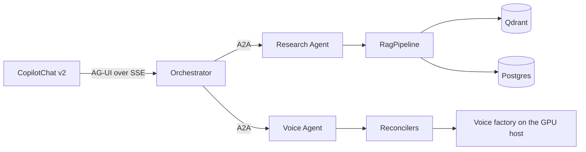
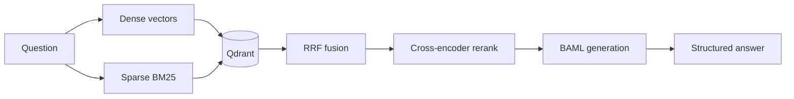
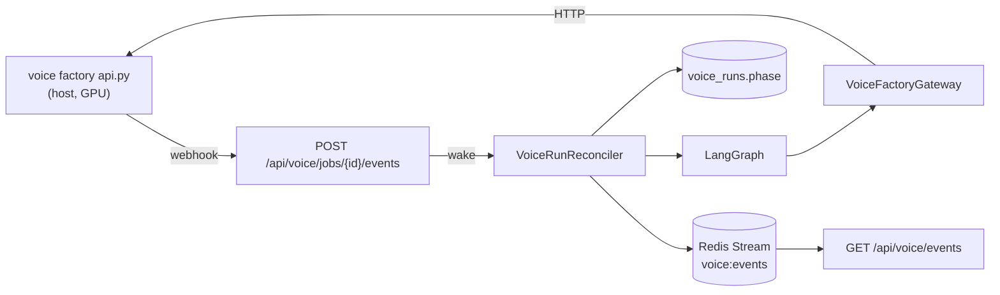

# pythonapi

The agent service. One FastAPI process that serves a REST API, three A2A
agents, an MCP server, an agent registry, and two background reconcilers.

It runs on port 8000. Every REST router mounts under `/api`. The OpenAPI schema
is at `/api/openapi.json` and the docs are at `/docs`.

See the [repo README](../../README.md) for the stack as a whole.

---

## What this service is

Four surfaces share one process, and each is addressed on purpose.

| Surface    | Address                                       | Protocol       |
| ---------- | --------------------------------------------- | -------------- |
| REST API   | `/api/*`                                      | HTTP + JSON    |
| Chat agent | `/api/agent`                                  | AG-UI over SSE |
| A2A agents | `/agents/{orchestrator,research,voice}`       | A2A JSON-RPC   |
| MCP server | `/mcp/rag`                                    | MCP            |
| Registry   | `/api/ard` and `/.well-known/ai-catalog.json` | ARD            |

The specialists mount **outside** `/api` on purpose. They are not this
service's REST surface. They are separate agents that happen to share the
process. Turning a mount off is how an agent moves to its own process, and
nothing else in `main.py` changes.

The ARD manifest sits at the origin root because RFC 8615 defines a well-known
URI relative to the origin. It cannot move under `/api`. The registry itself
does sit under `/api/ard`, because `/api/search` already exists and a second,
unrelated search one path segment away would be a trap for anyone reading the
route table.

---

## The agent endpoint

`POST /api/agent` speaks the [AG-UI protocol](https://github.com/ag-ui-protocol/ag-ui).
It takes a `RunAgentInput` and streams the run back as server-sent AG-UI events.
The CopilotKit v2 front end consumes that format natively, so it connects here
directly through an AG-UI `HttpAgent`. There is no CopilotKit runtime and no
Next.js proxy in between.

The v1 `copilotkit` Python SDK is deliberately not a dependency. It implements
the v1 remote-endpoint protocol, which v2 clients cannot talk to. Bridging the
two needs a translation layer this service does not carry.

Because the browser calls this route cross-origin, `CORS_ALLOW_ORIGINS` must
list the web app's origin. It is comma-separated, and it defaults to
`http://localhost:4001`.

---

## The agent network

Three agents. The Orchestrator faces the user. Two specialists answer over A2A.



| Protocol | Between                       | Carries                          |
| -------- | ----------------------------- | -------------------------------- |
| AG-UI    | Browser and Orchestrator      | One chat run, streamed as events |
| A2A      | Orchestrator and a specialist | One delegated task               |
| HTTP     | Voice Agent and the factory   | Pipeline jobs on the GPU host    |

AG-UI is the user-facing protocol. A2A is the agent-to-agent protocol. Neither
replaces the other.

### Cards, not hard-coded lists

Each specialist publishes an Agent Card at
`<mount>/.well-known/agent-card.json`. The Orchestrator reads capabilities and
skills from that card. It never hard-codes them.

`a2a_support/cards.py` is the single builder for every card, so two cards
cannot drift on the fields the spec requires each one to declare. The SDK's
types are used directly and no card is parsed from hand-written JSON, because a
hand-rolled dict is exactly the "custom JSON presented as A2A" the spec forbids.

### Mounted or standalone, same app

`build_research_app()` returns a self-contained ASGI app.
`mount_research_agent()` attaches it to this service under a prefix.
`python -m pythonapi.agents.research` serves the same app on its own port. The
agent is identical either way. Only its address changes.

A mounted specialist is reached over an in-process ASGI transport. A specialist
with a configured A2A URL is reached over the network. Both speak real A2A
JSON-RPC through the SDK's own client, so delegation code cannot tell the
difference, and no code path fakes the protocol.

A mounted agent shares the parent's Qdrant and Postgres connections rather than
opening a second set of its own. The standalone entrypoint reuses this
service's `lifespan`, so the clients are built by the one wiring path that
already exists.

```powershell
# Run a specialist on its own port
python -m pythonapi.agents.research   # :8001
python -m pythonapi.agents.voice      # :8002
python -m pythonapi.agents.orchestrator  # :8003
```

### Routing

`agents/orchestrator/routing.py` classifies a request into `research`, `voice`,
`research_and_voice`, or `general`. Deterministic rules run first. An LLM router
is the fallback for what the rules cannot classify safely, not the default,
because routing must be predictable and cheap.

The rules match intent words, never a specialist's skill list. Skills come from
the Agent Cards at delegation time, so adding a skill to an agent does not mean
editing the router.

One specialist's failure is contained. It never touches the other.

---

## The RAG MCP server

`/mcp/rag` exposes the document corpus to any MCP client. Four read-only tools:

| Tool               | Reuses               |
| ------------------ | -------------------- |
| `search_documents` | `retrieve_documents` |
| `answer_question`  | `RagResearchAgent`   |
| `list_documents`   | `DocumentRepository` |
| `get_document`     | `DocumentRepository` |

Each tool wraps a code path that already exists and is already tested, rather
than adding a new one. `answer_question` runs the same `RagResearchAgent` the
Research Agent runs over A2A, so an MCP client and an A2A caller get the same
answer for the same question, from one implementation.

Write and delete are left out of this version. They are Postgres and Qdrant
mutations that need a permission model an MCP client does not have here. An
unauthenticated tool call must never change the corpus.

`mcp_support/tools.py` holds the tool roster as one enum. Both the code that
registers the tools and the code that describes them in the ARD catalog read
that enum. Neither carries its own copy of a tool's name or description.

---

## The ARD registry

Agentic Resource Discovery publishes what this deployment offers, and ranks a
natural-language query against it.

| Method | Path                           | Purpose                          |
| ------ | ------------------------------ | -------------------------------- |
| GET    | `/.well-known/ai-catalog.json` | The publisher manifest           |
| GET    | `/api/ard/agents`              | Browse the catalog, no ranking   |
| POST   | `/api/ard/search`              | Rank the catalog against a query |
| POST   | `/api/ard/explore`             | Facet counts over the catalog    |

**The catalog is derived, never maintained beside the truth.**
`core/ard_catalog.py` reads the real `AgentCard` objects the three agents
already build, and the MCP tool roster enum. A second hand-written list of
agents or tools would drift within a week, and drift is the exact failure ARD
exists to prevent.

The field mapping falls out of the two specs with nothing hand-written:

| ARD entry field         | Source on the A2A `AgentCard`         |
| ----------------------- | ------------------------------------- |
| `identifier`            | `urn:air:<publisher>:agent:<slug>`    |
| `displayName`           | `card.name`                           |
| `url`                   | the specialist's public card URL      |
| `capabilities`          | `[skill.id for skill in card.skills]` |
| `representativeQueries` | flattened `skill.examples`            |

The MCP server has no served card for `url` to point at, because MCP's own
discovery is a runtime handshake rather than a JSON document at a well-known
path. Its entry carries an inline descriptor in `data` instead, built from the
tool roster the same way an agent entry is built from a card's skills.

`response_model_exclude_none` on these routes is not cosmetic. A catalog entry
must carry exactly one of `url` or `data`, and a serialized `"data": null`
reads as present to a validator that tests for the key.

Set `ARD_ENABLED=false` to unpublish the whole surface.

---

## The RAG pipeline

Retrieve, rerank, generate.



Qdrant holds chunk vectors only. Postgres holds all document, chunk, and order
metadata. Dense and sparse legs each fetch `RETRIEVAL_PREFETCH_LIMIT`
candidates before fusion.

Documents are parsed and chunked with Docling. Embedding runs through a
background worker pool rather than in the request, so an upload returns at once.

All LLM traffic routes through the shared LiteLLM gateway. In compose, this
service, BAML, and the public `/api/v1/*` OpenAI-compatible proxy all target
LiteLLM first, and LiteLLM routes to the configured backend, such as LM Studio.

---

## The voice pipeline

Two entities, and the split between them is the design.

- A **run** is one video's ingest: `downloading` to `diarizing` to `ingested`.
- A **voice** is a durable trained model: `awaiting_commit`, `compiling`,
  `training`, `exporting`, `ready`.

A voice dataset is built from clips taken from many videos, and a video gives
clips to many voices. So there is no "commit a run" step and no run-level
training. The unit of work is a clip decision. The unit of training is a voice.

Review is not a phase that waits for a button. Reviewers decide clips, for as
long as they like, and a voice compiles whatever the decisions say when it next
trains. Review status is derived from clip state and never stored.

`ingested` is a terminal resting phase rather than a review gate. It has to
exist: `voice_runs.phase` **is** the state machine, and the reconciler ticks any
run whose phase it owns, so a run with no resting phase would be re-ticked
forever and re-fetch its clips on every pass.

### How state moves



`VoiceTrainingReconciler` does the same for `voices.phase`.

- **A reconciler is the only writer of phase state.** The webhook reports a
  change and calls `wake(id)`. It never decides what the phase becomes. So a
  lost webhook costs latency only, because the reconcile timer is the backstop.
- **There is no LangGraph checkpointer.** Training takes days and a human review
  can sit longer, so a run must survive a restart. The phase column does that.
- **Leases give mutual exclusion.** Several API instances can run at once.
  `leased_until` and `lease_owner` are claimed in one atomic UPDATE, and the
  lease expires on its own, so a dead instance never strands a run.
- **Redis carries events, never state.** Losing Redis loses live updates and
  nothing else, so a publish failure is logged and swallowed. The Redis Stream
  ID is the event ID and the SSE `id:`, which is why there is no sequence
  column.
- **Every SSE event carries the complete object, never a patch.** Applying one
  twice lands on the same result, which is what makes reconnect replay cheap.
- **Errors hold, they do not fail fast.** A transient factory error (refused,
  timed out, 5xx) holds the phase and increments `error_count`. Only
  `VOICE_MAX_CONSECUTIVE_ERRORS` in a row fail a run, and
  `POST /runs/{id}/retry` puts it back in `failed_from_phase`.
- **Training logs stay off the event stream.** `GET /runs/{id}/logs` serves
  them, so every browser does not pay for output one screen reads.

`VOICE_FACTORY_URL` points at the control API. Unset, every `/api/voice` route
answers 503 and the reconcilers never start. Nothing else is affected.

### One forwarder for factory-owned data

The factory owns videos, clips, review decisions, characters, and clip audio.
`review.csv` on that host stays the one source of truth for clip decisions.
This service stores run and voice state, and nothing on disk.

So `routes/voice_factory_proxy.py` forwards every factory-owned call untouched,
modelled on `openai_proxy.py` for the same reason: a route here that retyped a
factory shape would be a second definition of data this service never reads. A
field the factory adds reaches the browser with no change here.

Typed gateway calls still exist, and should. `VoiceFactoryGateway` earns its
models where Python actually reads the fields.

The hop buys one thing: the browser talks to this origin alone, so the factory
needs no CORS entry and never faces the network.

`voice_runs` gained columns for the current design. The project uses
`Base.metadata.create_all`, which does not migrate an existing table, so drop
and recreate the voice tables in development. Alembic is a separate task.

---

## Layout

```text
apps/pythonapi/
├── baml_src/                # BAML source: clients, generators, rag
├── litellm.config.yaml      # LiteLLM model aliases
├── tests/                   # pytest suite
└── pythonapi/
    ├── main.py              # App assembly only: lifespan, middleware, routers
    ├── config.py            # Settings. All env vars land here.
    ├── dependencies.py      # FastAPI DI providers
    ├── baml_client/         # GENERATED — never edit
    ├── agents/              # One package per agent
    │   ├── orchestrator/    # chat_agent, delegating_agent, routing, card
    │   ├── research/        # rag_research_agent, card, executor
    │   └── voice/           # pipeline_voice_agent, card, executor
    ├── a2a_support/         # cards, discovery, delegation, execution, service
    ├── mcp_support/         # rag_server, tools, app
    ├── core/                # Business logic. No HTTP, no I/O clients.
    │   ├── chat_agent.py, rag_pipeline.py, ard_catalog.py
    │   ├── embeddings.py, reranking.py, generation.py
    │   ├── document_parsing.py, pii.py
    │   ├── voice_factory_gateway.py, voice_operations.py
    │   ├── voice_run_graph.py, voice_training_graph.py
    │   └── voice_graph_support.py, voice_run_assignment.py
    ├── infrastructure/      # External client builders, one per system
    ├── repositories/        # Persistence: SQLAlchemy and Qdrant only
    ├── models/              # Pydantic schemas + SQLAlchemy ORM (orm.py)
    ├── routes/              # Thin HTTP layer, delegates to core/
    ├── middleware/          # idempotency.py
    └── workers/             # embedding_worker, voice_run_reconciler,
                             # voice_training_reconciler
```

`baml_client/` is generated from `baml_src/`. Regenerate it with
`nx baml-generate pythonapi`. Never edit it by hand.

**Layer rule:** `routes/` to `core/` to `repositories/` to `infrastructure/`.
Never import in the other direction.

**File length is a prompt, not a rule.** A file past roughly 200 to 300 lines is
a reason to go look. One clear responsibility at that length is fine and stays
as it is. Split only where a file genuinely does two jobs, such as mixing
orchestration with HTTP shaping. No lint rule enforces this and no CI check
counts lines.

---

## App assembly

`main.py` does one job: build every external client once in `lifespan()`, store
it on `app.state`, and wire up middleware and routers. No business logic lives
there.

Each subsystem is its own async context manager. `lifespan()` enters them in
construction order through an `AsyncExitStack`, so teardown falls out of that
order automatically. There is no hand-ordered `finally` block to keep in sync as
subsystems are added or removed.

CORS is added last so it sits outermost. Starlette runs the most recently added
middleware first, and CORS has to answer preflights before anything else can
reject them.

Never build a client per request.

---

## Configuration

Defaults live in `Settings` in `config.py`. **The service boots with no
environment file at all**, on offline mock providers and an in-process Qdrant.
That is what `pytest` and `nx serve pythonapi` run on. An environment variable
is an override, never a requirement.

To add a setting: add the field to `Settings` with a real default. Stop there.
Add a key to an env file only when Docker needs a different value.

Never write a bare `= None` default. A missing variable then reaches its
consumer as `None` and fails at the call site, far from the cause. `None` is
correct only for secrets, and for integrations where it means "feature off".
`tests/test_config.py` enforces this and holds the allow-list.

`config.py` sets no Pydantic `env_file` on purpose. This service reads real
process environment variables only, because a dotenv path would resolve against
the process working directory rather than this package, and could silently pick
up an unrelated `.env`. Compose does the injecting.

Read settings from `settings`, never from `os.environ`.

Optional integrations degrade, they do not crash. Redis, Langfuse, and Postgres
may all be unset. Qdrant always works through embedded `:memory:`.

The PII vault is the deliberate exception. An unset key does not reduce
function. It disables masking entirely, so raw PII would flow through unmasked.
`main.py` logs a loud warning on that path, given the higher stakes.

`GET /api/health` reports which optional integrations are configured, and
whether each one currently answers.

See the [repo README](../../README.md#configuration) for the full key table and
the three-location layout.

---

## Commands

Run from the repo root, in PowerShell.

```powershell
nx serve pythonapi           # uvicorn on :8000
nx test pythonapi            # pytest with coverage
nx lint pythonapi            # ruff check
nx run pythonapi:format      # ruff format
nx baml-generate pythonapi   # regenerate baml_client from baml_src
nx sync pythonapi            # sync the uv environment
nx lock pythonapi            # refresh uv.lock
nx add pythonapi --name <package>   # add a dependency, updates uv.lock
```

> `nx format pythonapi` does **not** do what it looks like. `format` is an Nx
> built-in, so the project name is ignored and Prettier runs over the whole
> workspace. This project's Ruff target is only reachable as
> `nx run pythonapi:format`.

---

## Tests

`pytest` with `pytest-asyncio`. The suite runs fully offline and deterministic,
because all three providers default to `mock` and Qdrant runs embedded in
memory. No test downloads a model and no test needs Docker.

```powershell
nx test pythonapi
uv run pytest tests/test_ard.py -k catalog   # one file, from apps/pythonapi
```

The suite covers each surface separately: the REST routes, the chat agent, each
specialist agent, orchestrator delegation, the MCP server, the ARD catalog,
idempotency, PII, and the voice run and training paths.

---

## Conventions

- Every I/O path is `async`. No blocking call sits inside an `async def`, and no
  sync driver appears in a route.
- All Postgres access uses SQLAlchemy 2.0 async. No raw SQL anywhere.
- Functions and variables use `snake_case`. Classes use `PascalCase`. Settings
  are `UPPER_SNAKE_CASE` fields on `Settings`.
- No abbreviations. Write `cancellation_token`, not `ct`.
- Enums or `Literal` types, never a bare string comparison.
- Names say what a thing is. `QdrantEmbeddingIndex`, not `VectorService`.
- A comment explains **why**, never **what**. `main.py` and `config.py` are the
  model to follow.
- Ruff enforces line length 88 and import order. Run `nx run pythonapi:format`
  before you commit.
