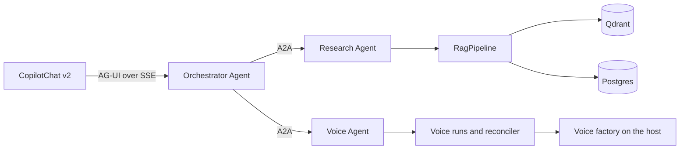

# Agent network

The system runs three agents. One faces the user. Two are specialists that
answer over the A2A protocol.

## Which protocol does what

| Protocol | Between                       | Carries                          |
| -------- | ----------------------------- | -------------------------------- |
| AG-UI    | Browser and Orchestrator      | One chat run, streamed as events |
| A2A      | Orchestrator and a specialist | One delegated task               |
| HTTP     | Voice Agent and the factory   | Pipeline jobs on the GPU host    |

AG-UI is the user-facing protocol. A2A is the agent-to-agent protocol. They
are not interchangeable, and neither replaces the other.

## Why only three agents

An agent is used where a component has an independent capability and a
useful boundary. A normal function is used everywhere else. There is no
agent for every tool, no planner agent, and no memory agent.

The test of value is the diagnosis workflow: ask why a training run is slow,
and the Orchestrator must combine the Voice Agent's run data with the
Research Agent's troubleshooting content into one answer. If A2A did not earn
that, it would be decoration.

## How the specialists are addressed

Each specialist publishes an Agent Card at
`<mount>/.well-known/agent-card.json`. The Orchestrator reads capabilities
and skills from that card. It never hard-codes them.

By default both specialists are mounted inside `pythonapi`, so the whole
network runs in one process. Setting a specialist's A2A URL moves it to its
own process, and nothing else changes.

See [research-agent](research-agent.md) and [voice-agent](voice-agent.md).
