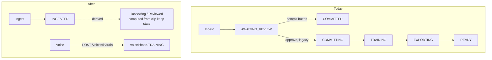

# Remove the run-level commit and training pipeline

Status: built 2026-08-24, except step 4 (the table drop), which is yours
to run. See "Step 4: drop and recreate" at the end.

## Why

A `VoiceRun` currently owns two things it must not own: a "commit" step, and a
training pipeline. Both are wrong for how the product actually works.

A voice dataset is built from clips taken from **many** videos. A video gives
clips to **many** voices. So there is no such thing as committing "a run":

- The unit of work is a clip decision, not a run.
- The unit of training is a Voice, not a run.
- Review is not a phase a run waits in. Review is continuous. A video is being
  reviewed until every clip is kept or excluded, and reviewed once none are
  left undecided.

`AWAITING_REVIEW` is wrong because it names a state a person must leave by
pressing a button. Nobody presses a button. They decide clips.

## What exists today

Three separate mechanisms overlap. Only the third is correct.

| # | Mechanism | Entry point | Status |
|---|-----------|-------------|--------|
| 1 | Manual run commit | `POST /api/voice/runs/{id}/commit` → `commit_reviewed_run` | Remove |
| 2 | Legacy run training | `POST /api/voice/runs/{id}/approve` → `approve_voice_review` → `COMMITTING` → `TRAINING` → `EXPORTING` → `READY` | Remove |
| 3 | Voice training | `POST /api/voices/{id}/train` → `VoiceTrainingReconciler` → `VoicePhase` | Keep. This is the only correct one |

Mechanism 2 trains `run.primary_character` straight off the run. It pre-dates
the `Voice` entity. It is unreachable from the current front end, but it is
still wired into the A2A voice agent as a review skill.



## Evaluation of the plan

Three findings. One kills a part of the original plan outright.

### Finding 1 — "diarizing becomes the terminal phase" is wrong

The first draft said the reconciler could simply stop advancing after
`DIARIZING`. That is incorrect. `voice_runs.phase` **is** the state machine and
the reconciler ticks any run whose phase is in `_NODE_PHASES`. A run left in
`DIARIZING` would be re-ticked forever, re-fetching clips on every pass.

A terminal resting phase is not optional. It is what tells the reconciler to
stop.

**Fix:** add `INGESTED` as the terminal phase. It states a fact about ingest,
not about review, so it does not re-introduce the concept being removed. Review
status is then derived from clip state and never stored.

Final `VoiceRunPhase`: `DOWNLOADING`, `DIARIZING`, `INGESTED`, `FAILED`.
`RESTING_PHASES` becomes `{INGESTED, FAILED}`.

### Finding 2 — merge-on-assignment needs reversibility the factory cannot do

This is the biggest risk in the plan, and it is worth reversing the earlier
decision.

The chosen design was: the moment a clip is `keep=true` and has an
`assigned_voice`, merge it into that voice's dataset. That is clean in
principle. It is hard in practice, because the current merge is append-only and
one-way:

- `commit_reviewed_clips` opens `metadata.csv` in append mode (`"a"`).
- `committed.csv` is an append-only ledger of `clip_id|dataset_id`.
- The wav is copied or sliced into `dataset/wavs/`.

None of that can be undone. But under merge-on-assignment every decision is
reversible by design:

| Reviewer action | Required effect on the dataset |
|-----------------|--------------------------------|
| kept → excluded | delete the wav, remove the metadata line |
| kept → unreviewed | delete the wav, remove the metadata line |
| reassign voice A → B | delete from A, add to B, edit both ledgers |
| trim bounds after merge | re-slice the wav in place |

So merge-on-assignment requires writing delete and rewrite paths for
`metadata.csv`, `committed.csv`, and the wav directory. Every one of those is a
new failure mode that can silently corrupt a dataset a training run then reads.

**Recommendation: compile the dataset at train time instead.**

`POST /voices/{id}/train` gathers every clip that is `keep=true` and assigned to
that voice, across every video, and materialises `dataset/wavs/` and
`metadata.csv` from scratch. Properties:

- Idempotent. Running it twice gives the same folder.
- No ledger. `committed.csv` stops being needed for this path.
- No delete logic. Un-assigning a clip just means it is not gathered next time.
- The folder is always exactly the current set of decisions, which is what
  "the voice uses only the audio clips we saved" actually means.

The cost is that training start does more work. That work is seconds of file
copying against a job that runs for days.

This contradicts the earlier answer that picked merge-on-assignment. The
information that changes it — append-only `metadata.csv`, the `committed.csv`
ledger, and four separate un-merge cases — only surfaced when the factory's
merge internals were read. Flagging it rather than building the harder design
quietly.

### Finding 3 — dropping enum values breaks existing rows

`voice_runs.phase` stores the enum by value. Removing `COMMITTING`, `TRAINING`,
`EXPORTING`, `READY`, `COMMITTED`, and `AWAITING_REVIEW` makes any existing row
holding one of those unparseable on read.

`Base.metadata.create_all` never alters a table, so this needs the documented
drop-and-recreate of the four voice tables, then a `pythonapi` restart. The
`commit_stage_index` column is dropped in the same pass.

## Change list

### star-trek-voyicer (voice factory)

| File | Change |
|------|--------|
| `core/review_workflow.py` | Add a train-time compile that rebuilds one voice's `dataset/` from every kept, assigned clip. Keep `commit_reviewed_clips` only if something else still needs it; otherwise remove it with `committed.csv`. |
| `routes/` | Expose the compile on the training start path, so starting a voice's training is what builds its dataset. |

### pythonapi

| File | Change |
|------|--------|
| `models/voice_run.py` | `VoiceRunPhase` → `DOWNLOADING`, `DIARIZING`, `INGESTED`, `FAILED`. Delete `commit_stage_index`. `RESTING_PHASES` → `{INGESTED, FAILED}`. |
| `models/orm.py` | Drop the `commit_stage_index` column. |
| `core/voice_run_graph.py` | Delete `_committing_node_factory` and the `COMMITTING` / `TRAINING` / `EXPORTING` nodes, their entry-point map entries, and their `_NODE_PHASES` members. `_diarizing_node_factory` advances to `INGESTED`. |
| `core/voice_run_assignment.py` | Delete `commit_reviewed_run`. Replace `require_awaiting_review` with a check that ingest finished, or drop the gate — assignment is legal any time after diarizing. |
| `core/voice_operations.py` | Delete `approve_voice_review` and `NO_SPEAKER_ASSIGNED`. |
| `routes/voice_runs.py` | Delete the `commit_run` and `approve_run` routes and their imports. |
| `agents/voice/interface.py` | Delete `VoiceReviewRequest` and the review skill from the protocol. |
| `agents/voice/pipeline_voice_agent.py` | Delete the review skill handler. |
| `repositories/voice_runs.py` | Check `claim_runs` and any phase-filtered query against the new enum. |
| `tests/` | `test_voice.py`, `test_voice_assign_commit.py` need rework, not find-and-replace. `test_voice_assign_commit.py` may go entirely. |

### agentic-executor (front end)

| File | Change |
|------|--------|
| `features/voices/types.ts` | `VoiceRunPhases` → `downloading`, `diarizing`, `ingested`, `failed`. Update `PhaseLabels`. |
| `features/voices/api/use_voice_runs.ts` | Delete `useCommitRun`. |
| `features/voices/clip_list_panel.tsx` | Delete the "Commit run" button and its disabled state. |
| `features/voices/derive.ts` | `toneForPhase` collapses to the three real phases. Add a helper that derives review status from clips. |
| `features/voices/clip_review_pane.tsx`, `video_card.tsx` | Show derived "Reviewing (n left)" or "Reviewed" where the phase pill was. |

## Derived review status

One helper, fed by the clips the speaker board already returns. No new
endpoint, no stored column.

```ts
type ReviewStatus = "reviewing" | "reviewed"

// A clip with keep === null has no decision yet. Reviewed means none are left.
function reviewStatus(clips: ClipSummary[]): ReviewStatus {
  return clips.some((clip) => clip.keep === null) ? "reviewing" : "reviewed"
}
```

This depends on the tri-state `keep` work already completed: `keep` is
`boolean | null` on the wire, and `null` means undecided.

## Sequencing

1. Factory: build the train-time dataset compile, with tests.
2. Factory: point training start at it. Confirm a voice trains from clips spread
   across more than one video.
3. pythonapi: delete mechanisms 1 and 2, shrink the enum, fix the graph.
4. Drop and recreate the four voice tables. Restart `pythonapi`.
5. Front end: delete the button, derive review status.
6. Run `nx run-many -t lint test typecheck` and the factory's `just
   test-jeanlucrecord`.

Steps 1 and 2 come first because they replace the only real work the commit
step did. Deleting commit before the replacement exists would leave no path
from a reviewed clip to a trained voice.

## Open question

Finding 2 recommends train-time compile over merge-on-assignment. That reverses
an earlier decision and needs a yes before step 1 starts.

---

## Finding 4 — deleting COMMITTING orphans resample and preprocess

Found while implementing, 2026-08-24. It changes the factory work in step 1.

`_committing_node_factory` runs three factory stages back to back, not one:

```
youtube-commit -> resample -> preprocess
```

Only the first is a commit step. `resample` copies `dataset/` to `resampled/`
at 22.05 kHz, and `preprocess` turns `resampled/` into
`work/<character>/training/`, which is the directory `stage_train` reads with
`--dataset-dir`. The Voice training node calls `start_job(stage="train")`
straight away and never runs either one.

So voice training works today only because a run walked `COMMITTING` first for
that same character. Delete `COMMITTING` as written and `train` reads a stale
or missing `training/` directory.

**Fix:** the train-time compile absorbs all three steps, and it lives on the
Voice, not the run.

- Factory gains one stage, `compile-dataset`, which replaces `youtube-commit`.
  It rebuilds `work/<character>/dataset/` from scratch from every `keep=1`
  row whose `assigned_voice` names that character, across every video. No
  `committed.csv`, no append, no delete paths.
- `VoicePhase` gains `COMPILING` ahead of `TRAINING`. Its node walks
  `compile-dataset -> resample -> preprocess`, one stage per tick, using the
  same shape `_committing_node_factory` has today.
- `voices` gains `compile_stage_index`. It is the same column being dropped
  from `voice_runs`, moved to where the work now happens.
- `POST /voices/{id}/train` sets `COMPILING`, not `TRAINING`.

Final `VoicePhase`: `AWAITING_COMMIT`, `COMPILING`, `TRAINING`, `EXPORTING`,
`READY`, `FAILED`. `RESTING_PHASES` is unchanged.

## Decisions taken

- Finding 2: train-time compile. Confirmed 2026-08-24.
- Finding 4: compile absorbs resample and preprocess, on the Voice.
- Step 4's drop and recreate is run by hand, not by this change.


---

## Step 4: drop and recreate — not yet run

`Base.metadata.create_all` never alters a table, so the running database still
holds the old enum values and the old columns. Every voice run and voice row
dies. Nothing else in the database is touched.

Run this against the `pythonapi` database, then restart `pythonapi`:

```sql
DROP TABLE IF EXISTS voice_contributions;
DROP TABLE IF EXISTS voice_run_speakers;
DROP TABLE IF EXISTS voices;
DROP TABLE IF EXISTS voice_runs;
```

Order matters: the two association tables carry the foreign keys, so they go
first. `create_all` rebuilds all four on the next start with the new
`VoiceRunPhase` values, the new `VoicePhase.COMPILING`, `voices.compile_stage_index`,
and no `voice_runs.commit_stage_index`.

Nothing on the voice factory host is affected. `review.csv` keeps every clip
decision, so a re-ingest is not needed - but the runs that pointed at those
videos are gone, so each video needs claiming again.

## What was built

| Step | State |
|------|-------|
| 1. Factory train-time compile, with tests | Done. 106 tests pass |
| 2. Factory training start points at it | Done. `compile-dataset` stage |
| 3. pythonapi deletions, enum, graph | Done. 226 tests pass |
| 4. Drop and recreate the four tables | **Yours to run.** See above |
| 5. Front end | Done. Typecheck and tests at baseline |

`test_agent.py::test_agent_runs_without_an_api_key` fails before and after this
change: it wants an OpenAI key. The front-end lint and typecheck baselines are
also unchanged (6 lint problems, 5 typecheck errors, all pre-existing).
